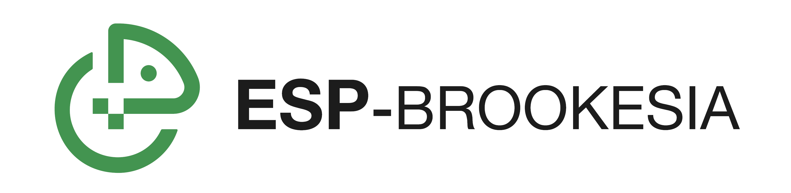

# ESP-Brookesia

* [中文版本](./README_CN.md)

## Overview

ESP-Brookesia is a human-machine interaction development framework designed for AIoT devices. It aims to simplify the processes of user UI design and application development by supporting efficient development tools and platforms, thereby accelerating the development and market release of customers' HMI application products.

> [!NOTE]
> "[Brookesia](https://en.wikipedia.org/wiki/Brookesia)" is a genus of chameleons known for their ability to camouflage and adapt to their surroundings, which closely aligns with the goals of the ESP-Brookesia. This framework aims to provide a flexible and scalable UI solution that can adapt to various devices, screen sizes, and application requirements, much like the Brookesia chameleon with its high degree of adaptability and flexibility.

The key features of ESP-Brookesia include:

- Developed based on C/C++, natively supporting the ESP-IDF development system and fully leveraging the Espressif open-source component ecosystem
- Offers a rich set of standardized system UIs with support for dynamic UI style adjustments.
- Implements an app-based application management approach, ensuring UI isolation and coexistence across multiple apps, enabling users to focus on UI implementation within their target app.
- Application UIs are compatible with "[Squareline](https://squareline.io/) exported code" development methods.

The system UI functionality demonstration is as follows:

    

    <a href="https://docs.espressif.com/projects/esp-dev-kits/en/latest/esp32p4/esp32-p4-function-ev-board/index.html">ESP32-P4-Function-EV-Board</a> running system UI - <a href="./docs/system_ui_phone_CN.md">Phone</a>
     
    (<a href="https://dl.espressif.com/AE/esp-dev-kits/esp_ui_phone_demo_1024_600_compress.mp4">Click to view the video</a>)

 

The functional block diagram of ESP-Brookesia is as follows, mainly consisting of the following components:

    

 

- **HAL**: Uses the hardware abstraction layer provided by ESP-IDF to provide access and control of underlying hardware.
- **Middle**: Acts as a bridge connecting applications with underlying hardware, interfacing with the hardware abstraction layer through `Function Components` while providing standardized interfaces to applications through `System Services`, achieving decoupling and isolation of system resources.
- **Application**: Provides AI application scenario support through `AI Framework`, including `HMI` (humanized interaction design for single and dual screens), `Agent` (compatible with mainstream LLM models like Doubao and Xiaozhi), and `Protocol` (MCP protocol for unified communication between LLM and system services). Provides various product-oriented (mobile devices, speakers, robots, etc.) system and application (settings, AI assistant, app store, etc.) support through `System Framework`.

## Built-in Systems

Currently, ESP-Brookesia includes the following built-in systems:

- [Phone](./docs/system_ui_phone.md)

## How to Use

Please refer to the documentation - [How to Use](./docs/how_to_use.md).
