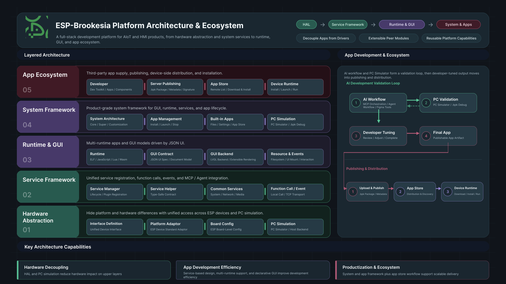

<div align="center">
    
</div>

# ESP-Brookesia

* [中文版本](./README_CN.md)

## Overview

ESP-Brookesia is a full-stack development platform for AIoT and HMI products. It organizes hardware abstraction, service framework, runtimes, GUI, system framework, app components, and AI capabilities as ESP-IDF components so products can compose and reuse platform capabilities as needed.

> [!NOTE]
> [Brookesia](https://en.wikipedia.org/wiki/Brookesia) is a genus of chameleons known for small form factors and strong adaptability. ESP-Brookesia uses this image to emphasize that the framework can adapt to different hardware forms, interaction surfaces, and product systems.

## Main Architecture Layers

<div align="center">
    
</div>
<br>

- **Hardware Abstraction**: hides platform and hardware differences, unifies device access, and supports ESP devices and PC simulation.
- **Service Framework**: unifies service registration, function calls, event publish/subscribe, and MCP / Agent capability connections.
- **Runtime and GUI**: supports multi-runtime apps and the JSON UI-driven GUI model.
- **System Framework**: provides the product-level system framework that integrates GUI, Runtime, services, and app lifecycle.
- **App Ecosystem**: covers third-party app supply, upload and publish, device-side distribution, and installation.

## Main Architecture Features

- **Hardware Decoupling**: HAL and PC simulation reduce the impact of hardware differences on upper-layer apps and systems.
- **App Development Efficiency**: service-based design, multi-runtime support, and declarative GUI improve app development and validation efficiency.
- **Productization and Ecosystem**: the system and app frameworks combine with the app-store mechanism to support scalable product delivery.
- **AI-Assisted Development Loop**: AI Workflow and PC Validation form a development validation loop. Developers review, tune, and supplement the result to generate a publishable app.
- **Publishing and Distribution Flow**: apps can move through Upload & Publish, App Store, and Device Runtime to complete publishing, discovery, download, installation, and execution.

## ESP-Brookesia Versioning

From `v0.7`, ESP-Brookesia is componentized. Projects are recommended to obtain required components through the component registry. The conventions are:

1. Components evolve independently but share the same `major.minor` version and depend on the same ESP-IDF release.
2. The `release` branch maintains historical stable versions and only fixes bugs and security issues.
3. The `master` branch continuously integrates new features and may contain functionality that has not stabilized yet.

| ESP-Brookesia | ESP-IDF | Main changes | Status |
| --- | --- | --- | --- |
| master (v0.8) | ESP32-S31: 6.2<br>Others: >= 6.0, <= 6.2 | Componentized publishing expands to GUI, Runtime, System, App, and AI capabilities; adds PC simulation, JSON UI, multi-runtime support, and the standard System Super mainline | Active development |
| release/v0.7 | >= 5.5, <= 6.0 | Component manager support | Stable version, bug and security fixes only |
| release/v0.6 | >= 5.3, <= 5.5 | Preview system framework; ESP-VoCat firmware project | End of maintenance |

## Documentation

- 中文：https://docs.espressif.com/projects/esp-brookesia/zh_CN
- English: https://docs.espressif.com/projects/esp-brookesia/en

## Quick Reference

- [Getting Started](https://docs.espressif.com/projects/esp-brookesia/en/latest/getting_started.html)
- [Utils Components](https://docs.espressif.com/projects/esp-brookesia/en/latest/utils/index.html)
- [Hardware Components](https://docs.espressif.com/projects/esp-brookesia/en/latest/hal/index.html)
- [Service Components](https://docs.espressif.com/projects/esp-brookesia/en/latest/service/index.html)
- [GUI Components](https://docs.espressif.com/projects/esp-brookesia/en/latest/gui/index.html)
- [Runtime Components](https://docs.espressif.com/projects/esp-brookesia/en/latest/runtime/index.html)
- [System Components](https://docs.espressif.com/projects/esp-brookesia/en/latest/system/index.html)
- [App Components](https://docs.espressif.com/projects/esp-brookesia/en/latest/app/index.html)

## Component List

### Utils Components

| Component | Description | Version |
| --- | --- | --- |
| [brookesia_lib_utils](https://components.espressif.com/components/espressif/brookesia_lib_utils) | Core utility library providing task scheduler, thread configuration, profilers, logging, state machines, plugins, and other foundational capabilities | [](https://components.espressif.com/components/espressif/brookesia_lib_utils) |
| [brookesia_mcp_utils](https://components.espressif.com/components/espressif/brookesia_mcp_utils) | MCP bridge library that registers Brookesia service functions or custom callbacks as MCP tools for LLM invocation | [](https://components.espressif.com/components/espressif/brookesia_mcp_utils) |

### Hardware Components (HAL)

| Component | Description | Version |
| --- | --- | --- |
| [brookesia_hal_interface](https://components.espressif.com/components/espressif/brookesia_hal_interface) | HAL foundation component defining the unified device/interface model, lifecycle management, and hardware interface abstractions | [](https://components.espressif.com/components/espressif/brookesia_hal_interface) |
| [brookesia_hal_adaptor](https://components.espressif.com/components/espressif/brookesia_hal_adaptor) | ESP device board adaptation component that initializes real peripherals through `esp_board_manager` and registers HAL interface implementations | [](https://components.espressif.com/components/espressif/brookesia_hal_adaptor) |
| [brookesia_hal_boards](https://components.espressif.com/components/espressif/brookesia_hal_boards) | ESP device board configuration component providing board peripheral topology, pins, driver parameters, and Kconfig defaults | [](https://components.espressif.com/components/espressif/brookesia_hal_boards) |

> [!NOTE]
> PC simulation support is provided by `hal/brookesia_hal_linux` and `hal/brookesia_hal_wasm` in this repository for Linux host, CI, and WebAssembly/Web demo scenarios.

### Service Components

#### Service Framework

| Component | Description | Version |
| --- | --- | --- |
| [brookesia_service_manager](https://components.espressif.com/components/espressif/brookesia_service_manager) | Service manager providing plugin lifecycle, function routing, event publish/subscribe, local calls, and TCP RPC | [](https://components.espressif.com/components/espressif/brookesia_service_manager) |
| [brookesia_service_helper](https://components.espressif.com/components/espressif/brookesia_service_helper) | Service helper library providing type-safe schemas, helper calls, and unified service access interfaces | [](https://components.espressif.com/components/espressif/brookesia_service_helper) |
| [brookesia_service_custom](https://components.espressif.com/components/espressif/brookesia_service_custom) | Custom service extension template for product-specific capabilities based on the Brookesia service framework | [](https://components.espressif.com/components/espressif/brookesia_service_custom) |

#### Network Services

| Component | Description | Version |
| --- | --- | --- |
| [brookesia_service_http](https://components.espressif.com/components/espressif/brookesia_service_http) | HTTP service providing HTTP/HTTPS client requests, resource limits, and request lifecycle events | [](https://components.espressif.com/components/espressif/brookesia_service_http) |
| [brookesia_service_sntp](https://components.espressif.com/components/espressif/brookesia_service_sntp) | SNTP service providing NTP server management, timezone settings, and automatic time synchronization | [](https://components.espressif.com/components/espressif/brookesia_service_sntp) |
| [brookesia_service_wifi](https://components.espressif.com/components/espressif/brookesia_service_wifi) | Wi-Fi service providing state-machine management, AP scan, connection management, and SoftAP functionality | [](https://components.espressif.com/components/espressif/brookesia_service_wifi) |

#### Media Services

| Component | Description | Version |
| --- | --- | --- |
| [brookesia_service_audio](https://components.espressif.com/components/espressif/brookesia_service_audio) | Audio service providing playback, codec, volume control, and playback state management | [](https://components.espressif.com/components/espressif/brookesia_service_audio) |
| [brookesia_service_video](https://components.espressif.com/components/espressif/brookesia_service_video) | Video service supporting local capture encoding and compressed stream decoding to pixel formats | [](https://components.espressif.com/components/espressif/brookesia_service_video) |
| [brookesia_service_display](https://components.espressif.com/components/espressif/brookesia_service_display) | Display service wrapping display input, gestures, and display-related system capabilities | [](https://components.espressif.com/components/espressif/brookesia_service_display) |

#### System Services

| Component | Description | Version |
| --- | --- | --- |
| [brookesia_service_storage](https://components.espressif.com/components/espressif/brookesia_service_storage) | Storage service providing namespace-based key-value storage management | [](https://components.espressif.com/components/espressif/brookesia_service_storage) |
| [brookesia_service_device](https://components.espressif.com/components/espressif/brookesia_service_device) | Device service providing app-layer access to device control, status query, and protocol interfaces | [](https://components.espressif.com/components/espressif/brookesia_service_device) |

#### Agent and Expression Services

| Component | Description | Version |
| --- | --- | --- |
| [brookesia_agent_manager](https://components.espressif.com/components/espressif/brookesia_agent_manager) | Agent manager providing AI agent lifecycle, state machine, and unified operation interfaces | [](https://components.espressif.com/components/espressif/brookesia_agent_manager) |
| [brookesia_agent_coze](https://components.espressif.com/components/espressif/brookesia_agent_coze) | Coze agent adapter providing Coze API integration, WebSocket communication, and agent management | [](https://components.espressif.com/components/espressif/brookesia_agent_coze) |
| [brookesia_agent_openai](https://components.espressif.com/components/espressif/brookesia_agent_openai) | OpenAI agent adapter providing OpenAI API integration and agent management | [](https://components.espressif.com/components/espressif/brookesia_agent_openai) |
| [brookesia_agent_xiaozhi](https://components.espressif.com/components/espressif/brookesia_agent_xiaozhi) | XiaoZhi agent adapter providing XiaoZhi API integration | [](https://components.espressif.com/components/espressif/brookesia_agent_xiaozhi) |
| [brookesia_expression_emote](https://components.espressif.com/components/espressif/brookesia_expression_emote) | AI emote and animation management for visual feedback in anthropomorphic interactions | [](https://components.espressif.com/components/espressif/brookesia_expression_emote) |

#### Emulation Services

| Component | Description | Version |
| --- | --- | --- |
| [brookesia_emulation_nes](https://components.espressif.com/components/espressif/brookesia_emulation_nes) | NES emulation service integrating display, audio, storage, and gamepad control | [](https://components.espressif.com/components/espressif/brookesia_emulation_nes) |

### GUI Components (GUI)

| Component | Description | Version |
| --- | --- | --- |
| [brookesia_gui_interface](https://components.espressif.com/components/espressif/brookesia_gui_interface) | GUI interface layer defining JSON UI document model, runtime resources, action binding, and backend contracts | [](https://components.espressif.com/components/espressif/brookesia_gui_interface) |
| [brookesia_gui_lvgl](https://components.espressif.com/components/espressif/brookesia_gui_lvgl) | LVGL backend mapping resolved GUI documents to LVGL objects and handling events, animations, and image resources | [](https://components.espressif.com/components/espressif/brookesia_gui_lvgl) |

### Runtime Components (Runtime)

| Component | Description | Version |
| --- | --- | --- |
| [brookesia_runtime_manager](https://components.espressif.com/components/espressif/brookesia_runtime_manager) | Runtime manager for dynamic app packages, runtime backend registration, and app context management | [](https://components.espressif.com/components/espressif/brookesia_runtime_manager) |
| [brookesia_runtime_elf](https://components.espressif.com/components/espressif/brookesia_runtime_elf) | ELF runtime backend | [](https://components.espressif.com/components/espressif/brookesia_runtime_elf) |
| [brookesia_runtime_js](https://components.espressif.com/components/espressif/brookesia_runtime_js) | JavaScript runtime backend | [](https://components.espressif.com/components/espressif/brookesia_runtime_js) |
| [brookesia_runtime_lua](https://components.espressif.com/components/espressif/brookesia_runtime_lua) | Lua runtime backend | [](https://components.espressif.com/components/espressif/brookesia_runtime_lua) |
| [brookesia_runtime_wasm](https://components.espressif.com/components/espressif/brookesia_runtime_wasm) | WebAssembly runtime backend | [](https://components.espressif.com/components/espressif/brookesia_runtime_wasm) |

### System and App Components (System & App)

| Component | Description | Version |
| --- | --- | --- |
| [brookesia_system_core](https://components.espressif.com/components/espressif/brookesia_system_core) | System core framework orchestrating app lifecycle, GUI, Runtime, services, storage, and permission boundaries | [](https://components.espressif.com/components/espressif/brookesia_system_core) |
| [brookesia_system_super](https://components.espressif.com/components/espressif/brookesia_system_super) | Standard system for rectangular touch devices with Shell, launcher, overlay, status bar, and built-in resource flow | [](https://components.espressif.com/components/espressif/brookesia_system_super) |
| [brookesia_app_files](https://components.espressif.com/components/espressif/brookesia_app_files) | Files app providing a device-side file browser entry | [](https://components.espressif.com/components/espressif/brookesia_app_files) |
| [brookesia_app_settings](https://components.espressif.com/components/espressif/brookesia_app_settings) | Settings app providing device and system configuration entry | [](https://components.espressif.com/components/espressif/brookesia_app_settings) |
| [brookesia_app_store](https://components.espressif.com/components/espressif/brookesia_app_store) | App Store component providing local and remote app package entries | [](https://components.espressif.com/components/espressif/brookesia_app_store) |

## Getting the Repository

If you would like to contribute to ESP-Brookesia or build on the examples in this repository, you can get the `master` branch with the following command:

```bash
git clone https://github.com/espressif/esp-brookesia
```

## Contribution Guidelines

We currently welcome contributions in the following areas:

- Fixing bugs
- Adding support for new development boards to [brookesia_hal_boards](./hal/brookesia_hal_boards)

For new component ideas, we recommend starting a discussion in [GitHub Issues](https://github.com/espressif/esp-brookesia/issues) first so we can align on the use case, interface boundaries, and overall roadmap together. Once there is agreement on the direction, the follow-up contribution process is usually much smoother.

## Additional Resources

- Latest documentation: https://docs.espressif.com/projects/esp-brookesia/en, built from the [docs](./docs) directory of this repository;
- ESP-IDF Programming Guide: https://docs.espressif.com/projects/esp-idf/en;
- ESP-Brookesia components can be found on [ESP Component Registry](https://components.espressif.com/);
- Visit the [esp32.com](https://www.esp32.com/) forum to ask questions and explore community resources;
- If you find a bug or need a new feature, please check [GitHub Issues](https://github.com/espressif/esp-brookesia/issues) first to avoid duplicate submissions;
