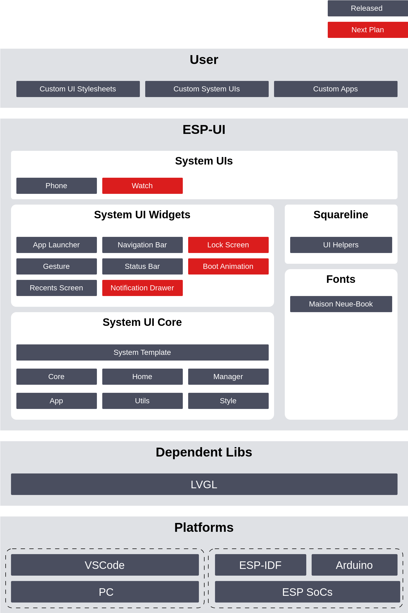

 

**最新 Arduino 库版本**: 

**最新 Espressif 组件版本**: 

# ESP-Brookesia

* [English Version](./README.md)

## 概述

ESP-Brookesia 是一个面向物联网设备的人机交互开发框架，旨在简化用户 UI 设计和应用程序开发的流程，它支持高效的开发工具与平台，加速客户 HMI 应用产品的开发与上市。

> [!NOTE]
> "[Brookesia](https://en.wikipedia.org/wiki/Brookesia)" 是一种变色龙属的物种，擅长于伪装和适应环境，这与 ESP-Brookesia 的目标紧密相关。该框架旨在提供一种灵活、可扩展的 UI 解决方案，能够适应各种不同的设备、屏幕大小和应用需求，就像 Brookesia 变色龙那样，具有高度的适应性和灵活性。

ESP-Brookesia 的主要特性包括：

- 采用 C++ 开发，可在 `PC` 或 `ESP SoCs` 平台上编译，并支持 `VSCode`、`ESP-IDF`、`Arduino` 开发环境。
- 提供丰富的标准化系统 UI，支持动态调整 UI 样式。
- 采用 app 的应用管理方式，实现多个 app 的 UI 隔离与共存，使用户专注于各自 app 内的 UI 实现。
- 应用 UI 兼容 "[Squareline](https://squareline.io/) 导出代码" 的开发方式。

各系统 UI 的功能演示如下：

    

    <a href="https://docs.espressif.com/projects/esp-dev-kits/zh_CN/latest/esp32p4/esp32-p4-function-ev-board/index.html">ESP32-P4-Function-EV-Board</a> 运行系统 UI - <a href="./docs/system_ui_phone_CN.md">Phone</a>
     
    （<a href="https://dl.espressif.com/AE/esp-dev-kits/esp_ui_phone_demo_1024_600_compress.mp4">点击查看视频</a>）

 

ESP-Brookesia 的功能框图如下，主要由以下几个部分组成：

    

 

- **System UI Core**：实现了所有系统 UI 统一的核心逻辑，包括 app 管理、样式表管理、事件管理等。
- **System UI Widgets**：封装了系统 UI 的通用控件，包括状态栏、导航栏、手势等。
- **System UIs**：基于 "System UI Core" 和 "System UI Widgets" 实现了多种类型的系统 UI。
- **Squareline**：包含多个 "Squareline Studio" 导出的不同版本的 *ui_helpers* 文件，避免同时在多个 app 内使用的函数重名问题。
- **Fonts**：包含系统 UI 默认使用的字体。

## 使用

请参阅文档 - [如何使用](./docs/how_to_use_CN.md) 。

## 系统 UIs

当前，ESP-Brookesia 提供了以下系统 UI：

- [Phone](./docs/system_ui_phone_CN.md)

## 系统 UI 控件

请参阅文档 - [系统 UI 控件](./docs/system_ui_widgets_CN.md) 。
