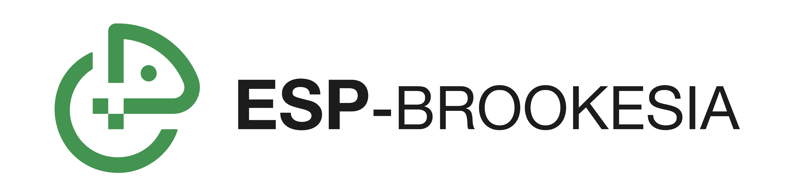

    

# ESP-Brookesia

* [English Version](./README.md)

## 概述

ESP-Brookesia 是一个面向 AIoT 设备的人机交互开发框架，旨在简化应用程序开发和 AI 能力集成的流程。它以 ESP-IDF 为基础，通过组件化架构为开发者提供从硬件抽象、系统服务到 AI 智能体的全栈支持，加速 HMI 与 AI 应用产品的开发与上市。

> [!NOTE]
> "[Brookesia](https://en.wikipedia.org/wiki/Brookesia)" 是一种变色龙属的物种，擅长于伪装和适应环境，这与 ESP-Brookesia 的目标紧密相关。该框架旨在提供一种灵活、可扩展的解决方案，能够适应各种不同的硬件设备和应用需求，就像 Brookesia 变色龙那样，具有高度的适应性和灵活性。

ESP-Brookesia 的主要特性包括：

- **原生 ESP-IDF 支持**：基于 C/C++ 开发，深度集成 ESP-IDF 开发体系与 ESP Registry 组件注册表，充分利用乐鑫开源组件生态；
- **可扩展的硬件抽象**：定义统一的硬件接口（音频、显示、触摸、存储等），并提供板级适配层，便于快速移植到不同硬件平台；
- **丰富的系统服务**：提供 Wi-Fi 连接、音视频处理等开箱即用的系统级服务，采用 Manager + Helper 架构实现解耦与扩展，为 Agent CLI 提供支持；
- **多 LLM 后端集成**：内置对 OpenAI、Coze、小智等主流 AI 平台的适配，提供统一的智能体管理与生命周期控制；
- **MCP 协议支持**：通过 Function Calling / MCP 协议将设备服务能力暴露给大语言模型，实现 LLM 与系统服务的统一通信；
- **AI 表达能力**：支持表情集、动画集等可视化 AI 表达，为拟人化交互提供丰富的视觉反馈。

ESP-Brookesia 的功能框架如下图所示，自底向上由 **环境与依赖**、**服务与框架** 以及 **应用层** 三个层级组成：

    

 

- **Utils 工具集**：为上层模块提供通用基础能力。其中 `General Utils` 包含日志系统、错误检查、状态机、任务调度器、插件管理、内存/线程/时间分析器等核心工具； `MCP Utils` 作为 ESP-Brookesia 服务体系与 MCP 引擎之间的桥梁，将已注册的服务函数暴露为标准 MCP 工具，实现大语言模型对设备能力的调用。
- **HAL 硬件抽象**：定义统一的硬件访问接口并提供板级适配实现。其中 `Interface` 定义音频播放/录制、显示面板/触摸、状态 LED、存储文件系统等标准化硬件接口； `Adaptor` 针对具体开发板提供接口实现，完成硬件资源的初始化与映射。 `Boards` 提供板级 YAML 配置，描述各开发板的外设拓扑、引脚与驱动参数。
- **General Service 通用服务**：提供系统级基础服务，包括 `Wi-Fi` 连接管理、`Audio` 音频采集与播放、`Video` 视频编解码、`NVS` 非易失性存储、`SNTP` 网络时间同步，以及 `Custom` 自定义服务扩展机制。所有服务均基于 Manager + Helper 架构，支持本地调用与 RPC 远程通信。
- **AI Agent 智能体框架**：提供 AI 智能体的统一管理框架，内置对 `Coze`、`OpenAI`、`小智` 等主流 AI 平台的适配。通过 `Function Calling / MCP` 协议实现大语言模型与系统服务的双向通信，使 LLM 能够感知和调用设备的各项能力。
- **AI Expression 智能体表达**：提供 AI 交互场景下的可视化表达能力，包括 `Emote` 表情集与动画控制，为拟人化交互提供丰富的视觉反馈。
- **System 系统框架** *(规划中)*：面向不同产品形态（移动设备、音箱、机器人等）提供 GUI、系统管理与应用框架支持。
- **Runtime 运行时** *(规划中)*：提供 WebAssembly、Python、Lua 等脚本运行时支持，实现应用的动态加载与执行。

## 文档中心

- 中文：https://docs.espressif.com/projects/esp-brookesia/zh_CN
- English: https://docs.espressif.com/projects/esp-brookesia/en

## 快速参考

- [ESP-Brookesia 版本说明](https://docs.espressif.com/projects/esp-brookesia/zh_CN/latest/getting_started.html#getting-started-versioning)
- [开发环境搭建](https://docs.espressif.com/projects/esp-brookesia/zh_CN/latest/getting_started.html#getting-started-dev-environment)
- [硬件准备](https://docs.espressif.com/projects/esp-brookesia/zh_CN/latest/getting_started.html#getting-started-hardware)
- [如何获取和使用组件](https://docs.espressif.com/projects/esp-brookesia/zh_CN/latest/getting_started.html#getting-started-component-usage)
- [如何使用示例工程](https://docs.espressif.com/projects/esp-brookesia/zh_CN/latest/getting_started.html#getting-started-example-projects)

## 组件列表

#### 工具组件 (Utils)

| 组件 | 描述 | 版本 |
| --- | --- | --- |
| [brookesia_lib_utils](https://components.espressif.com/components/espressif/brookesia_lib_utils) | 核心工具库，提供任务调度器、线程配置、性能分析器、日志系统、状态机、插件系统等基础能力 |  |
| [brookesia_mcp_utils](https://components.espressif.com/components/espressif/brookesia_mcp_utils) | MCP 工具桥接库，将 Brookesia 服务函数或自定义回调注册为 MCP 工具，供大语言模型调用 |  |

#### 硬件抽象组件 (HAL)

| 组件 | 描述 | 版本 |
| --- | --- | --- |
| [brookesia_hal_adaptor](https://components.espressif.com/components/espressif/brookesia_hal_adaptor) | HAL 板级适配组件，针对具体开发板提供音频与 LCD 设备的接口实现 |  |
| [brookesia_hal_boards](https://components.espressif.com/components/espressif/brookesia_hal_boards) | HAL 开发板配置组件，提供各开发板的外设拓扑、引脚与驱动参数 |  |
| [brookesia_hal_interface](https://components.espressif.com/components/espressif/brookesia_hal_interface) | HAL 基础组件，定义统一的设备/接口模型、生命周期管理及硬件接口（音频、显示、触摸、存储等）抽象 |  |

#### 服务组件 (Service)

| 组件 | 描述 | 版本 |
| --- | --- | --- |
| [brookesia_service_audio](https://components.espressif.com/components/espressif/brookesia_service_audio) | 音频服务，提供音频播放、编解码、音量控制及播放状态管理 |  |
| [brookesia_service_custom](https://components.espressif.com/components/espressif/brookesia_service_custom) | 自定义服务扩展模板，用于基于 Brookesia 服务框架开发自定义服务 |  |
| [brookesia_service_device](https://components.espressif.com/components/espressif/brookesia_service_device) | 设备服务，提供应用层对 HAL 硬件抽象层的访问控制和状态查询功能 |  |
| [brookesia_service_helper](https://components.espressif.com/components/espressif/brookesia_service_helper) | 服务助手库，提供类型安全的定义、模式以及统一的服务调用接口（基于 CRTP 模式） |  |
| [brookesia_service_manager](https://components.espressif.com/components/espressif/brookesia_service_manager) | 服务管理器，提供基于插件的服务生命周期管理、双通信模式（本地调用与 TCP RPC）、事件发布/订阅机制 |  |
| [brookesia_service_nvs](https://components.espressif.com/components/espressif/brookesia_service_nvs) | NVS 非易失性存储服务，提供基于命名空间的键值对存储管理 |  |
| [brookesia_service_sntp](https://components.espressif.com/components/espressif/brookesia_service_sntp) | SNTP 网络时间服务，提供 NTP 服务器管理、时区设置和自动时间同步 |  |
| [brookesia_service_video](https://components.espressif.com/components/espressif/brookesia_service_video) | 视频服务，支持本地采集编码（H.264、MJPEG、RGB/YUV）及压缩流解码到像素格式 |  |
| [brookesia_service_wifi](https://components.espressif.com/components/espressif/brookesia_service_wifi) | Wi-Fi 服务，提供状态机管理、AP 扫描、连接管理和 SoftAP 功能 |  |

#### AI 智能体组件 (Agent)

| 组件 | 描述 | 版本 |
| --- | --- | --- |
| [brookesia_agent_coze](https://components.espressif.com/components/espressif/brookesia_agent_coze) | Coze 智能体适配，提供 Coze API 集成、WebSocket 通信及智能体管理 |  |
| [brookesia_agent_helper](https://components.espressif.com/components/espressif/brookesia_agent_helper) | 智能体助手库，提供类型安全的定义、模式及统一的智能体调用接口 |  |
| [brookesia_agent_manager](https://components.espressif.com/components/espressif/brookesia_agent_manager) | 智能体管理器，提供 AI 智能体生命周期管理、状态机控制及统一操作接口 |  |
| [brookesia_agent_openai](https://components.espressif.com/components/espressif/brookesia_agent_openai) | OpenAI 智能体适配，提供 OpenAI API 集成、端到端通信及智能体管理 |  |
| [brookesia_agent_xiaozhi](https://components.espressif.com/components/espressif/brookesia_agent_xiaozhi) | 小智智能体适配，提供小智 API 集成 |  |

#### AI 表达组件 (Expression)

| 组件 | 描述 | 版本 |
| --- | --- | --- |
| [brookesia_expression_emote](https://components.espressif.com/components/espressif/brookesia_expression_emote) | AI 表情集与动画管理，提供表情集、动画集和事件消息集，为拟人化交互提供丰富的视觉反馈 |  |

## 获取代码

如果您希望为 ESP-Brookesia 贡献代码，或基于仓库中的示例进行二次开发，可通过以下指令获取 `master` 分支代码：

``bash
git clone https://github.com/espressif/esp-brookesia
``

## 贡献说明

当前欢迎开发者进行以下几个方面的代码贡献：

- 修复任意 bug
- 向 [brookesia_hal_boards](./hal/brookesia_hal_boards) 组件添加新的开发板支持

对于新增组件的需求，我们更建议先在 [GitHub Issues](https://github.com/espressif/esp-brookesia/issues) 中发起讨论，便于大家一起确认使用场景、接口边界和整体规划；在需求达成一致后，再推进后续提交会更顺畅。

## 其它参考资源

- 最新版文档：https://docs.espressif.com/projects/esp-brookesia/zh_CN ，由本仓库 [docs](./docs) 目录构建；
- ESP-IDF 编程指南：https://docs.espressif.com/projects/esp-idf/zh_CN ；
- 可在 [ESP Component Registry](https://components.espressif.com/) 中找到 ESP-Brookesia 的各组件；
- 可前往 [esp32.com](https://www.esp32.com/) 论坛提问，挖掘社区资源；
- 如果您在使用中发现了错误或者需要新的功能，请先查看 [GitHub Issues](https://github.com/espressif/esp-brookesia/issues)，确保该问题不会被重复提交；
