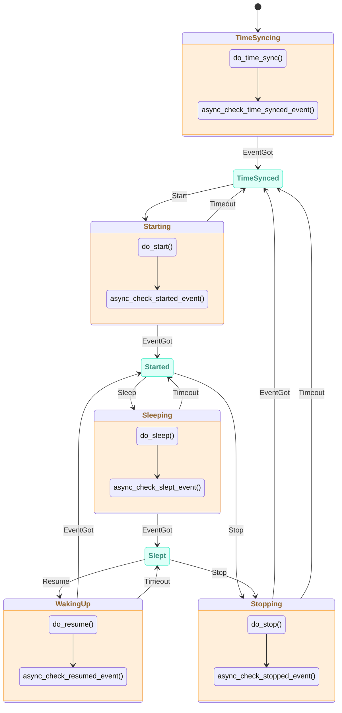

# ESP-Brookesia Agent Manager

* [中文版本](./README_CN.md)

## Overview

`brookesia_agent_manager` is an agent management framework for the ESP-Brookesia ecosystem, providing:

- **Unified Agent Lifecycle Management**: Centralized management of agent initialization, activation, start, stop, sleep, and wakeup through plugin mechanism, supporting dynamic switching between agents.
- **State Machine Management**: Automatic management of agent state transitions based on state machine, ensuring correctness and consistency of state transitions.
- **Agent Operation Control**: Supports agent operations such as suspend/resume, interrupt speaking, state querying, providing complete agent control capabilities.
- **Event-Driven Architecture**: Supports general action events, state change events, text interaction events, and emote events, enabling decoupled communication between agents and applications.
- **Feature Extension Support**: Supports extension features such as function calling, text processing, interrupt speaking, and emotes, flexibly enabled through agent attribute configuration.
- **Service Integration**: Based on `brookesia_service_manager` framework, provides unified service interfaces, integrating Audio service and SNTP service.
- **Persistent Storage**: Optionally integrates with `brookesia_service_nvs` service for persistent storage of agent activation state and other information.

## Table of Contents

- [ESP-Brookesia Agent Manager](#esp-brookesia-agent-manager)
  - [Overview](#overview)
  - [Table of Contents](#table-of-contents)
  - [State Machine Architecture](#state-machine-architecture)
    - [State Machine Diagram](#state-machine-diagram)
    - [State Descriptions](#state-descriptions)
  - [How to Use](#how-to-use)
    - [Development Environment Requirements](#development-environment-requirements)
    - [Adding to Project](#adding-to-project)
  - [FAQ](#faq)
    - [Application crashes when switching agents during agent voice playback](#application-crashes-when-switching-agents-during-agent-voice-playback)
    - [Audio service `PlayUrl` function behaves abnormally after agent executes Stop/Deactivate operation](#audio-service-playurl-function-behaves-abnormally-after-agent-executes-stopdeactivate-operation)

## State Machine Architecture

`brookesia_agent_manager` uses a state machine to manage agent lifecycle, ensuring correctness and consistency of state transitions.

### State Machine Diagram



### State Descriptions

| State | Type | Description |
|-------|------|-------------|
| **TimeSyncing** | Transient | Synchronizing time, waiting for time synchronization completion event |
| **TimeSynced** | Stable | Time synchronized, waiting for start command |
| **Starting** | Transient | Starting agent, waiting for start completion event |
| **Started** | Stable | Agent started, can receive audio input and output |
| **Sleeping** | Transient | Putting agent to sleep, waiting for sleep completion event |
| **Slept** | Stable | Agent slept, can be resumed or stopped |
| **WakingUp** | Transient | Waking up agent, waiting for wakeup completion event |
| **Stopping** | Transient | Stopping agent, waiting for stop completion event |

## How to Use

### Development Environment Requirements

Before using this library, please ensure the following SDK development environment is installed:

- [ESP-IDF](https://github.com/espressif/esp-idf): `>=5.5,<6`

> [!NOTE]
> For SDK installation instructions, please refer to [ESP-IDF Programming Guide - Installation](https://docs.espressif.com/projects/esp-idf/en/latest/esp32/get-started/index.html#get-started-how-to-get-esp-idf)

### Adding to Project

`brookesia_agent_manager` has been uploaded to the [Espressif Component Registry](https://components.espressif.com/). You can add it to your project in the following ways:

1. **Using Command Line**

   Run the following command in your project directory:

   ```bash
   idf.py add-dependency "espressif/brookesia_agent_manager"
   ```

2. **Modify Configuration File**

   Create or modify the *idf_component.yml* file in your project directory:

   ```yaml
   dependencies:
     espressif/brookesia_agent_manager: "*"
   ```

For detailed instructions, please refer to [Espressif Documentation - IDF Component Manager](https://docs.espressif.com/projects/esp-idf/en/latest/esp32/api-guides/tools/idf-component-manager.html).

## FAQ

### Application crashes when switching agents during agent voice playback

- This issue originates from the dependency component `jason-mao/av_processor`, and the developer is aware of it and working on a fix. To avoid abnormal exits, please wait for the current agent's voice playback to complete before switching agents.

### Audio service `PlayUrl` function behaves abnormally after agent executes Stop/Deactivate operation

- This issue originates from the dependency component `jason-mao/av_processor`, and the developer is aware of it and working on a fix.
