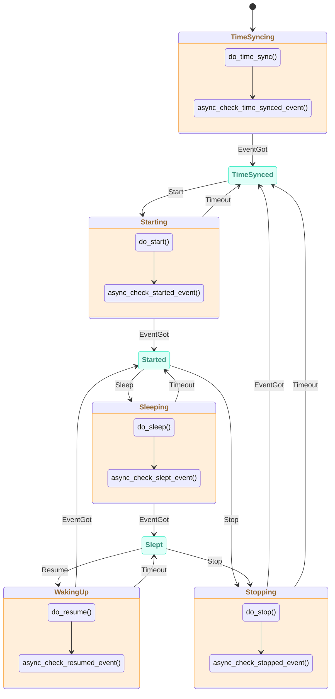

# ESP-Brookesia Agent Manager

* [English Version](./README.md)

## 概述

`brookesia_agent_manager` 是为 ESP-Brookesia 生态系统提供的智能体管理框架，提供：

- **统一的智能体生命周期管理**：通过插件机制，集中式管理智能体的初始化、激活、启动、停止、休眠和唤醒，支持智能体之间的动态切换。
- **状态机管理**：基于状态机自动管理智能体的状态转换，确保状态转换的正确性和一致性。
- **智能体操作控制**：支持智能体的暂停/恢复、中断说话、状态查询等操作，提供完整的智能体控制能力。
- **事件驱动架构**：支持通用操作事件、状态变化事件、文本交互事件和表情事件，实现智能体与应用之间的解耦通信。
- **功能扩展支持**：支持函数调用、文本处理、中断说话、表情等扩展功能，通过智能体属性配置灵活启用。
- **服务集成**：基于 `brookesia_service_manager` 框架，提供统一的服务接口，集成音频服务和 SNTP 服务。
- **持久化存储**：可选搭配 `brookesia_service_nvs` 服务持久化保存智能体激活状态等信息

## 目录

- [ESP-Brookesia Agent Manager](#esp-brookesia-agent-manager)
  - [概述](#概述)
  - [目录](#目录)
  - [状态机架构](#状态机架构)
    - [状态机图](#状态机图)
    - [状态说明](#状态说明)
  - [如何使用](#如何使用)
    - [开发环境要求](#开发环境要求)
    - [添加到工程](#添加到工程)
  - [常见问题](#常见问题)
    - [程序在智能体语音播放期间切换智能体时崩溃](#程序在智能体语音播放期间切换智能体时崩溃)
    - [智能体执行 Stop/Deactivate 操作后，Audio 服务调用 `PlayUrl` 函数功能异常](#智能体执行-stopdeactivate-操作后audio-服务调用-playurl-函数功能异常)

## 状态机架构

`brookesia_agent_manager` 使用状态机管理智能体的生命周期，确保状态转换的正确性和一致性。

### 状态机图



### 状态说明

| 状态 | 类型 | 说明 |
| ---- | ---- | ---- |
| **TimeSyncing** | 瞬态 | 正在同步时间，等待时间同步完成事件 |
| **TimeSynced** | 稳定 | 时间已同步，等待启动命令 |
| **Starting** | 瞬态 | 正在启动智能体，等待启动完成事件 |
| **Started** | 稳定 | 智能体已启动，可以接收音频输入和输出 |
| **Sleeping** | 瞬态 | 正在休眠智能体，等待休眠完成事件 |
| **Slept** | 稳定 | 智能体已休眠，可以恢复或停止 |
| **WakingUp** | 瞬态 | 正在唤醒智能体，等待唤醒完成事件 |
| **Stopping** | 瞬态 | 正在停止智能体，等待停止完成事件 |

## 如何使用

### 开发环境要求

使用本库前，请确保已安装以下 SDK 开发环境：

- [ESP-IDF](https://github.com/espressif/esp-idf): `>=5.5,<6`

> [!NOTE]
> SDK 的安装方法请参阅 [ESP-IDF 编程指南 - 安装](https://docs.espressif.com/projects/esp-idf/zh_CN/latest/esp32/get-started/index.html#get-started-how-to-get-esp-idf)

### 添加到工程

`brookesia_agent_manager` 已上传到 [Espressif 组件库](https://components.espressif.com/)，您可以通过以下方式将其添加到工程中：

1. **使用命令行**

    在工程目录下运行以下命令：

   ```bash
   idf.py add-dependency "espressif/brookesia_agent_manager"
   ```

2. **修改配置文件**

   在工程目录下创建或修改 *idf_component.yml* 文件：

   ```yaml
   dependencies:
     espressif/brookesia_agent_manager: "*"
   ```

详细说明请参阅 [Espressif 文档 - IDF 组件管理器](https://docs.espressif.com/projects/esp-idf/zh_CN/latest/esp32/api-guides/tools/idf-component-manager.html)。

## 常见问题

### 程序在智能体语音播放期间切换智能体时崩溃

- 该问题源于依赖组件 `jason-mao/av_processor`，目前开发者已知悉并在修复中。为避免异常退出，请在当前智能体语音播放完成后再进行切换操作。

### 智能体执行 Stop/Deactivate 操作后，Audio 服务调用 `PlayUrl` 函数功能异常

- 该问题源于依赖组件 `jason-mao/av_processor`，目前开发者已知悉并在修复中。
