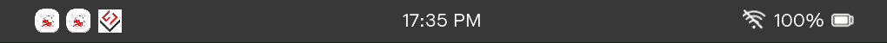
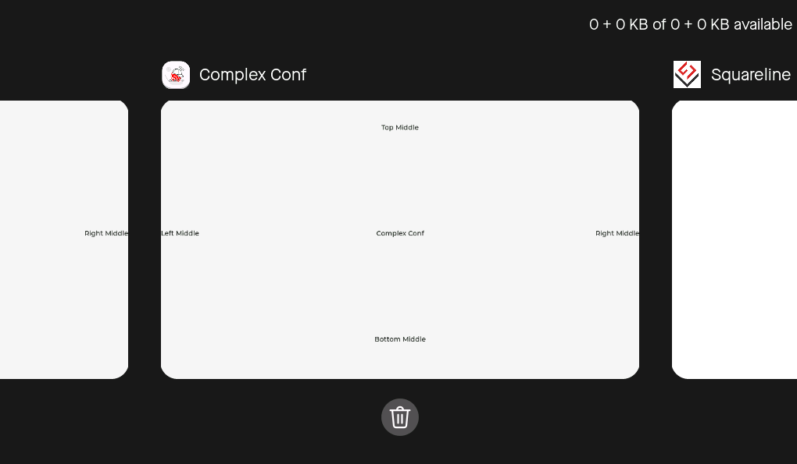

# Phone

* [English Version](./system_ui_phone.md)

## 简介

[Phone](../systems/phone/) 是一个类似于智能手机的系统 UI，在各种不同尺寸和分辨率屏幕的 ESP 开发板 上的运行效果如下所示：

    

具有以下特性：

- **硬件需求**：适用于具有 **触摸**、**鼠标** 或其他 [指针型输入设备](https://docs.lvgl.io/master/porting/indev.html#touchpad-mouse-or-any-pointer) 的屏幕。
- **多分辨率支持**：默认样式支持 `240 x 240` 及以上分辨率，并能根据分辨率自动调整 GUI 元素大小。
- **后台管理**：支持后台多 App 的共存与管理。
- **导航栏和手势控制**：支持在 App 内通过导航栏或手势控制界面的切换。

> [!NOTE]
> * Phone 的默认样式为了确保分辨率的兼容性，在许多分辨率上的显示效果可能不是最佳的，因此推荐使用与屏幕相同分辨率的 UI 样式表，如无合适样式表则需自行调整。
> * Phone 中 "Recents Screen" 显示 App GUI 截图的功能需要使能 LVGL 的 `LV_USE_SNAPSHOT` 配置，并要求提供充足的内存空间，否则截图会被替换成 App 图标。

为了使 Phone 在固定分辨率下达到最佳显示效果，esp-brookesia 目前提供了以下分辨率的 UI 样式表：

- [320 x 240](../systems/phone/stylesheets/320_240/)
- [320 x 480](../systems/phone/stylesheets/320_480/)
- [480 x 480](../systems/phone/stylesheets/480_480/)
- [720 x 1280](../systems/phone/stylesheets/720_1280/)
- [800 x 480](../systems/phone/stylesheets/800_480/)
- [800 x 1280](../systems/phone/stylesheets/800_1280/)
- [1024 x 600](../systems/phone/stylesheets/1024_600/)
- [1280 x 800](../systems/phone/stylesheets/1280_800/)

> [!NOTE]
> 如果上述 UI 样式表中没有您的屏幕分辨率，请参阅 Github issue - [Phone Resolution Support](https://github.com/espressif/esp-brookesia/issues/5)。

## 内置的 UI 组件

### Status Bar

[Status Bar](../systems/phone/widgets/status_bar/) 用于显示时间、电量、WiFi 状态以及 app 指定图标，运行效果如下图所示，具有以下特点：

    

- **位置**：屏幕顶部。
- **状态图标**：每个图标支持最多 6 张图片，并且支持自适应缩放，允许使用不同于样式表大小的图片。
- **时间信息**：允许设置系统时间，12h 格式为 `HH:MM AM/PM`, 24h 格式为 `HH:MM`。
- **电量信息**：允许设置电量状态，包含百分比和状态图标。
- **WiFi 状态**：允许设置 WiFi 连接状态，包含状态图标。

### App Launcher

[App Launcher](../systems/phone/widgets/app_launcher/) 用于显示所有已安装 app 的图标，运行效果如下图所示，具有以下特点：

    

- **位置**：屏幕中间。
- **App 图标**：每个 app 图标支持最多一张图片，并且支持自适应缩放，允许使用不同于样式表大小的图片。
- **多页显示**：通过左右滑动切换页面。
- **页面指示器**：位于控件的底部，指示当前页面的位置。

### Navigation Bar

[Navigation Bar](../systems/phone/widgets/navigation_bar/) 提供导航按键，运行效果如下图所示，具有以下特点：

    

- **位置**：屏幕底部。
- **导航按键**：提供 "后退"、"主页"、"概览屏幕" 三种按键，通过点击控制界面切换。
- **动态调整**：支持通过样式表参数调整按键位置顺序。

### Recents Screen

[Recents Screen](../systems/phone/widgets/recents_screen/) 用于显示正在运行中的 App，运行效果如下图所示，具有以下特点：

    

- **位置**：屏幕中间。
- **系统存储信息**：显示剩余和总存储空间大小。
- **后台 App**：显示当前后台 app 的 GUI 截图，并且支持自适应缩放。
- **手势控制**：通过左右滑动切换 App，上下滑动清理后台 App。
- **一键清理**：支持一键清理所有后台 App。

### Gesture

[Gesture](../systems/phone/widgets/gesture/) 用于获取输入设备的手势信息，具有以下特点：

- **指示条**

    - **位置**：位于屏幕 `左边缘`、`右边缘` 和 `下边缘`。
    - **显示**：默认隐藏，当检测到边缘位置触发手势动作时显示，并且随着手势在特定方向上移动而变化

- **手势信息**

    - **类型**：仅支持起始点和终止点之间的直线手势。
    - **方向**：包含 `上`、`下`、`左`、`右` 四个方向。
    - **位置**：包含 `中间`、`上边缘`、`下边缘`、`左边缘`、`右边缘` 五个位置。
    - **坐标**：包含起始点和终止点的坐标。
    - **时间**：包含手势的起始与终止的时间间隔。
    - **速度**：包含手势的速度。
    - **角度**：包含手势的角度。
