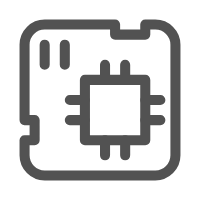

.. _index-sec-00:

ESP-Brookesia Programming Guide
===============================

:link_to_translation:`zh_CN:[中文]`

.. image:: ../_static/brookesia_logo.png
   :alt: ESP-Brookesia Logo
   :width: 800px
   :align: center

|

==================  ==================  ==================
|Getting Started|_   |Utils|_           |HAL|_
------------------  ------------------  ------------------
`Getting Started`_   `Utils`_           `HAL`_
------------------  ------------------  ------------------
|Service|_           |Agent|_           |Expression|_
------------------  ------------------  ------------------
`Service`_           `Agent`_           `Expression`_
==================  ==================  ==================

.. _Getting Started: getting_started.html
.. _index-nav-getting-started: getting_started.html

.. _Utils: utils/index.html
.. _index-nav-utils: utils/index.html

.. _HAL: hal/index.html
.. _index-nav-hal: hal/index.html

.. _Service: service/index.html
.. _index-nav-service: service/index.html

.. _Agent: agent/index.html
.. _index-nav-agent: agent/index.html

.. _Expression: expression/index.html
.. _index-nav-expression: expression/index.html

.. _index-sec-01:

.. rubric:: Overview

ESP-Brookesia is a human-machine interaction development framework for AIoT devices. It streamlines application development and AI capability integration. Built on ESP-IDF and a component-based architecture, it provides full-stack support from hardware abstraction and system services to AI agents, accelerating time-to-market for HMI and AI products.

.. NOTE::
   "Brookesia" is a genus of chameleons known for camouflage and adaptation—goals aligned with ESP-Brookesia. The framework aims to offer a flexible, scalable solution that adapts to diverse hardware and application needs, with high adaptability and flexibility like its namesake.

Key features of ESP-Brookesia:

- **Native ESP-IDF integration**: C/C++ development deeply integrated with ESP-IDF and the ESP Registry component catalog, leveraging Espressif’s open-source ecosystem.
- **Extensible hardware abstraction**: Unified hardware interfaces (audio, display, touch, storage) with board-level adaptation for fast porting.
- **Rich system services**: Wi-Fi, audio/video, using a Manager + Helper architecture for decoupling and extension, providing support for Agent CLI.
- **Multi-LLM backends**: Built-in adapters for OpenAI, Coze, XiaoZhi, and other platforms, with unified agent lifecycle management.
- **MCP protocol support**: Function Calling / MCP exposes device services to large language models for unified LLM–service communication.
- **AI expression**: Emoji sets, animations, and visual feedback for anthropomorphic interaction.

.. _index-sec-02:

.. rubric:: Architecture

ESP-Brookesia uses a layered design with three levels—**environment & dependencies**, **service & framework**, and **application**—as shown below.

.. image:: ../_static/framework_overview.svg
   :alt: ESP-Brookesia framework overview
   :width: 800px
   :align: center

|

.. _index-sec-03:

.. rubric:: Environment & dependencies

The runtime foundation. **ESP-IDF** provides the toolchain, RTOS, and peripheral drivers; **ESP Registry** manages distribution and versioning of framework components and third-party dependencies.

.. _index-sec-04:

.. rubric:: Service & framework

The core layer between the environment and applications. It exposes standardized service interfaces to applications and AI agents, covering utilities, HAL, system services, AI agents, and expression.

- **Utils**: General utilities (logging, checks, state machine, task scheduler, plugins, profilers) and **MCP Utils**, bridging Brookesia services and the MCP engine so registered service functions become standard MCP tools for LLMs.
- **HAL**: **Interface** defines audio, display, touch, status LED, and storage APIs; **Adaptor** provides board-specific implementations and resource mapping; **Boards** provides board-level YAML configuration describing the peripheral topology, pin assignments, and driver parameters.
- **General Service**: Wi-Fi, Audio, Video, NVS, SNTP, and **Custom** extensions. All services use Manager + Helper with local calls and RPC.
- **AI Agent**: Unified agent management with adapters for **Coze**, **OpenAI**, **XiaoZhi**, and **Function Calling / MCP** for bidirectional LLM–service communication.
- **AI Expression**: Visual expression including **Emote** sets and animation control for anthropomorphic UIs.
- **System framework** *(planned)*: GUI, system shell, and app frameworks for phones, speakers, robots, and similar products.
- **Runtime** *(planned)*: WebAssembly, Python, and Lua for dynamic loading and execution.

.. _index-sec-05:

.. rubric:: Application layer

Products and projects built on the layers above:

- **General Projects**: Product-oriented templates integrating framework components for direct product development.
- **System Apps** *(planned)*: Product-oriented system apps such as Settings, AI assistant, and app store, optional and integrable as needed.

.. toctree::
   :hidden:

   Getting Started <getting_started>
   Utils <utils/index>
   HAL <hal/index>
   Service <service/index>
   Agent <agent/index>
   Expression <expression/index>
