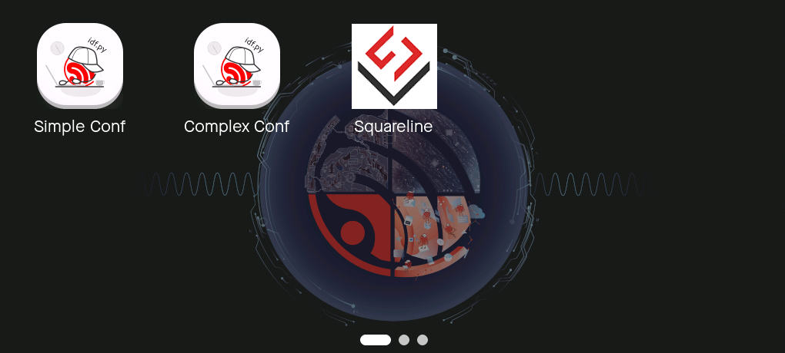
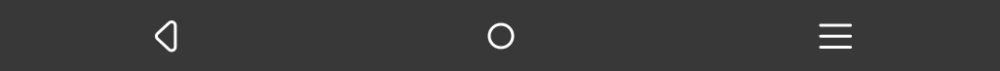

# System UI Widgets

* [中文版本](./system_ui_widgets_CN.md)

## Status Bar

The [Status Bar](../src/widgets/status_bar/) displays time, battery level, WiFi status, and app-specific icons. The appearance is shown in the image below and it has the following features:

    

- **Position**: Located at the top of the screen.
- **Status Icons**: Each icon supports up to 6 images with adaptive scaling, allowing the use of images different from the stylesheet size.
- **Time Information**: Allows setting the system time, 12h formatted as `HH:MM AM/PM` and 24h formatted as `HH:MM`.
- **Battery Information**: Allows setting the battery status, including both percentage and status icon.
- **WiFi Status**: Allows setting the WiFi connection status, including a status icon.

## App Launcher

The [App Launcher](../src/widgets/app_launcher/) displays all installed app icons. The appearance is shown in the image below and it has the following features:

    

- **Position**: Located in the center of the screen.
- **App Icons**: Each app icon supports up to one image with adaptive scaling, allowing the use of images different from the stylesheet size.
- **Multi-Page Display**: Switch between pages by swiping left or right.
- **Page Indicator**: Located at the bottom of the widget, indicating the current page position.

## Navigation Bar

The [Navigation Bar](../src/widgets/navigation_bar/) provides navigation buttons. The appearance is shown in the image below and it has the following features:

    

- **Position**: Located at the bottom of the screen.
- **Navigation Buttons**: Provides three buttons: "Back," "Home," and "Recents Screen," which control interface switching by clicking.
- **Dynamic Adjustment**: Supports adjusting the button position order through stylesheet parameters.

## Recents Screen

The [Recents Screen](../src/widgets/recents_screen/) displays the currently running apps. The appearance is shown in the image below and it has the following features:

    

- **Position**: Located in the center of the screen.
- **System Storage Information**: Displays the remaining and total storage space.
- **Background Apps**: Displays the GUI screenshots of the current background apps with adaptive scaling.
- **Gesture Control**: Switch apps by swiping left or right, and clear background apps by swiping up or down.
- **One-Tap Clean**: Supports cleaning all background apps with one tap.

## Gesture

[Gesture](../src/widgets/gesture/) is used to capture gesture information from input devices, with the following features:

- **Indicator Bar**:

    - **Position**: Located at the `left edge`, `right edge`, and `bottom edge` of the screen.
    - **Display**: Hidden by default, it appears when an edge gesture is detected and changes as the gesture moves in a specific direction.

- **Gesture Information**

    - **Type**: Only supports linear gestures between the start and end points.
    - **Direction**: Includes four directions: Up, Down, Left, and Right.
    - **Position**: Includes five positions: Center, Top Edge, Bottom Edge, Left Edge, and Right Edge.
    - **Coordinates**: Includes the coordinates of the start and end points.
    - **Time**: Includes the time interval between the start and end.
    - **Speed**: Includes the speed of the gesture.
    - **Angle**: Includes the angle of the gesture.
