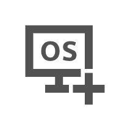
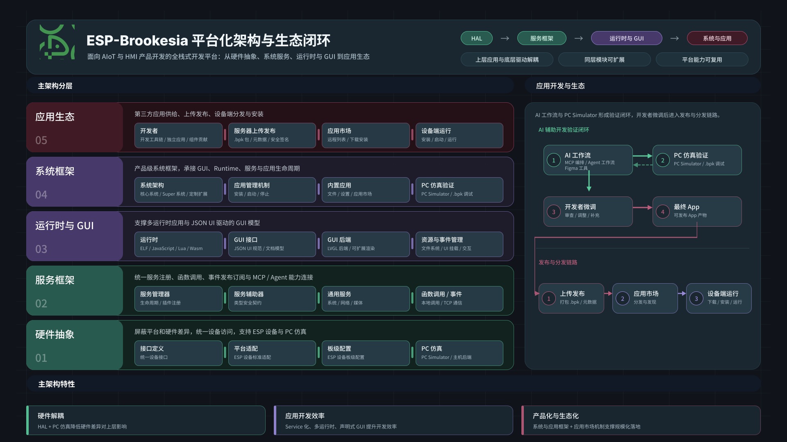

.. _index-sec-00:

ESP-Brookesia 编程指南
====================================

:link_to_translation:`en:[English]`

.. image:: ../_static/brookesia_logo.png
   :alt: ESP-Brookesia Logo
   :width: 800px
   :align: center

|

.. list-table::
   :widths: 33 33 34

   * - |快速开始|_
     - |工具组件|_
     - |硬件组件|_
   * - `快速开始`_
     - `工具组件`_
     - `硬件组件`_
   * - |服务组件|_
     - |GUI 组件|_
     - |运行时组件|_
   * - `服务组件`_
     - `GUI 组件`_
     - `运行时组件`_
   * - |系统组件|_
     - |应用组件|_
     -
   * - `系统组件`_
     - `应用组件`_
     -

.. |快速开始| image:: ../_static/index/getting_started.png
.. _快速开始: getting_started.html
.. _index-nav-getting-started: getting_started.html

.. |工具组件| image:: ../_static/index/utils.png
.. _工具组件: utils/index.html
.. _index-nav-utils: utils/index.html

.. |硬件组件| image:: ../_static/index/hal.png
.. _硬件组件: hal/index.html
.. _index-nav-hal: hal/index.html

.. |服务组件| image:: ../_static/index/service.png
.. _服务组件: service/index.html
.. _index-nav-service: service/index.html

.. _GUI 组件: gui/index.html
.. _index-nav-gui: gui/index.html

.. _运行时组件: runtime/index.html
.. _index-nav-runtime: runtime/index.html

.. _系统组件: system/index.html
.. _index-nav-system: system/index.html

.. _应用组件: app/index.html
.. _index-nav-app: app/index.html

.. _index-sec-01:

.. rubric:: 概述

ESP-Brookesia 是面向 AIoT 与 HMI 产品开发的全栈式开发平台。它以 ESP-IDF 组件形式组织硬件抽象、服务框架、运行时、GUI、系统框架、应用组件和 AI 能力，使产品可以按需组合并复用平台能力。

下面是 ESP-Brookesia 的整体架构图：

.. raw:: html

   

.. raw:: latex

  \vspace{1em}

.. _index-sec-02:

.. rubric:: 主架构分层

- **硬件抽象**：屏蔽平台和硬件差异，统一设备访问，支持 ESP 设备与 PC 仿真。
- **服务框架**：统一服务注册、函数调用、事件发布订阅与 MCP / Agent 能力连接。
- **运行时与 GUI**：支撑多运行时应用与 JSON UI 驱动的 GUI 模型。
- **系统框架**：产品级系统框架，承接 GUI、Runtime、服务与应用生命周期。
- **应用生态**：第三方应用供给、上传发布、设备端分发与安装。

.. _index-sec-03:

.. rubric:: 主架构特性

- **硬件解耦**：HAL 与 PC 仿真降低硬件差异对上层应用和系统的影响。
- **应用开发效率**：Service 化、多运行时和声明式 GUI 提升应用开发与验证效率。
- **产品化与生态化**：系统与应用框架结合应用市场机制，支撑规模化产品交付。

.. _index-sec-04:

.. rubric:: AI 辅助开发与应用生态

- **AI 开发验证闭环**：AI Workflow 与 PC Validation 形成开发验证闭环，开发者审查、调整并补充后生成可发布 App
- **发布与分发链路**：随后 App 进入 Upload & Publish、App Store 和 Device Runtime 链路，完成发布、发现、下载、安装和运行。

.. toctree::
   :hidden:

   快速开始 <getting_started>
   工具组件 <utils/index>
   硬件组件 <hal/index>
   服务组件 <service/index>
   应用组件 <app/index>
   GUI 组件 <gui/index>
   运行时组件 <runtime/index>
   系统组件 <system/index>
