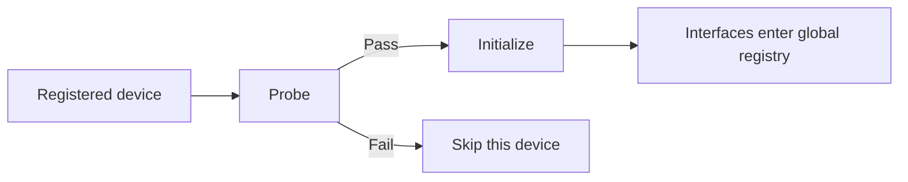

# ESP-Brookesia HAL Interface

* [中文版本](./README_CN.md)

## Overview

`brookesia_hal_interface` is the foundational hardware abstraction component for ESP-Brookesia. It provides a unified abstraction between **board-level implementations** and **upper-layer business logic or other subsystems**. Main capabilities include:

- **Device and interface model**: **Devices** group hardware units; **interfaces** express reusable capabilities (codec playback/recording, display panel/touch/backlight, storage volumes, and so on) with clear, composable roles
- **Plugin-based registration**: Concrete device and interface implementations are recorded in registries and resolved at runtime by name, avoiding hard-coded implementation classes in application code
- **Probing and lifecycle**: Devices probe for availability before initialization; batch or per-name initialization is supported, with symmetric deinitialization
- **Global discovery**: Devices can be resolved by plugin name or by device logical name; interfaces can be enumerated by type globally or retrieved by name within a device
- **Common HAL declarations**: Built-in abstract definitions for audio, display, storage, and related interfaces; actual behavior is provided by the adaptor layer

## Table of Contents

- [ESP-Brookesia HAL Interface](#esp-brookesia-hal-interface)
  - [Overview](#overview)
  - [Table of Contents](#table-of-contents)
  - [Features](#features)
    - [Device and Interface](#device-and-interface)
    - [Registration and Lifecycle](#registration-and-lifecycle)
    - [Discovery and Naming](#discovery-and-naming)
    - [Built-in Capabilities](#built-in-capabilities)
  - [Development Environment Requirements](#development-environment-requirements)
  - [Add to Your Project](#add-to-your-project)

## Features

### Device and Interface

A **device** represents an independently manageable hardware unit (for example, an audio codec path, a display subsystem, or a storage subsystem). Before normal operation, the device is **probed**: initialization runs only when the hardware is available in the current environment. During initialization, the device collects **interface instances** that it will expose externally.

An **interface** represents a stable capability boundary (for example, codec playback, recording, panel drawing, touch sampling, backlight control, storage medium and file-system discovery). Multiple instances of the same abstract type may exist; they are distinguished by the name used at registration, and that name uniquely identifies an instance in the global interface registry.

Device and interface implementation classes are registered through the project’s plugin mechanism; the framework creates or retrieves instances at runtime by name, while upper layers depend only on abstract types and contracts from this component.

### Registration and Lifecycle

During batch initialization, the framework walks the registry entry by entry: for each device it runs probing, then device-side initialization; after success, the framework registers the interfaces declared by that device into the global interface table. If probing or initialization fails for one device, usually only that device is affected and others can continue.

Initialization and deinitialization for **a single plugin registration name** are also supported. On deinitialization, registrations for that device’s interfaces are removed from the global table first, then device-specific cleanup runs, and the device releases its holds on interface instances.

A typical flow can be summarized as:



### Discovery and Naming

Two kinds of names relate to devices, with different roles:

| Name type | Meaning |
|-----------|---------|
| Plugin name | Key in the plugin registry; locates the device instance for that registration entry |
| Device name | Logical name carried by the device object; may match the plugin name or differ |

Either path can be used at runtime to resolve the corresponding device.

Access to interfaces goes through the **global interface registry**: you can list all instances convertible to a given interface type, or obtain the first matching instance of that type (name and instance returned together). If you already have a device object, you can also retrieve capabilities only from that device’s published interfaces, using the full interface name used at registration.

When multiple devices coexist, it is recommended to add a device-specific prefix or other namespace to interface registration names to avoid global collisions.

### Built-in Capabilities

The headers provide abstract definitions for common HAL interfaces; each type’s registry string is defined by the `NAME` constant on the class. The following headers are pulled in together by `brookesia/hal_interface/interfaces.hpp`:

| Header | Primary type |
|--------|----------------|
| `audio/codec_player.hpp` | `AudioCodecPlayerIface` |
| `audio/codec_recorder.hpp` | `AudioCodecRecorderIface` |
| `display/backlight.hpp` | `DisplayBacklightIface` |
| `display/panel.hpp` | `DisplayPanelIface` |
| `display/touch.hpp` | `DisplayTouchIface` |
| `storage/fs.hpp` | `StorageFsIface` |

They describe static information, capability parameters, and virtual interface contracts; register access, buses, and timing are handled by board adaptors or other components.

## Development Environment Requirements

Before using this component, ensure the following SDK is installed:

- [ESP-IDF](https://github.com/espressif/esp-idf): `>=5.5,<6`

> [!NOTE]
> For SDK installation steps, see the [ESP-IDF Programming Guide — Installation](https://docs.espressif.com/projects/esp-idf/en/latest/esp32/get-started/index.html).

## Add to Your Project

`brookesia_hal_interface` is published on the [Espressif Component Registry](https://components.espressif.com/). You can add it to your project as follows:

1. **Command line**

   From your project directory, run:

   ```bash
   idf.py add-dependency "espressif/brookesia_hal_interface"
   ```

2. **Configuration file**

   Create or edit *idf_component.yml* in your project directory:

   ```yaml
   dependencies:
     espressif/brookesia_hal_interface: "*"
   ```

For more information, see the Espressif documentation on the [IDF Component Manager](https://docs.espressif.com/projects/esp-idf/en/latest/esp32/api-guides/tools/idf-component-manager.html).
