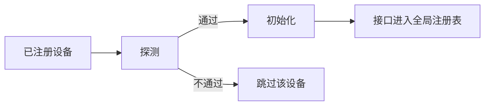

# ESP-Brookesia HAL Interface

* [English Version](./README.md)

## 概述

`brookesia_hal_interface` 是 ESP-Brookesia 的硬件抽象基础组件，在「板级实现」与「上层业务或其它子系统」之间提供统一抽象，主要能力包括：

- **设备与接口模型**：用「设备」聚合硬件单元，用「接口」表达可复用能力（编解码播放/录音、显示面板/触摸/背光、存储卷等），二者职责清晰、可组合
- **插件式注册**：具体设备与接口实现通过注册表登记，运行时按名称解析，避免业务侧硬编码实现类
- **探测与生命周期**：设备先探测是否可用，再初始化；支持批量或按名称单独初始化、对称反初始化
- **全局发现**：设备可按插件名或设备逻辑名解析；接口可在全局范围内按类型枚举或按设备内名称获取
- **常用 HAL 声明**：内置音频、显示、存储等接口的抽象定义，具体行为由适配层实现

## 目录

- [ESP-Brookesia HAL Interface](#esp-brookesia-hal-interface)
  - [概述](#概述)
  - [目录](#目录)
  - [功能特性](#功能特性)
    - [设备与接口](#设备与接口)
    - [注册与生命周期](#注册与生命周期)
    - [发现与命名](#发现与命名)
    - [内置能力范畴](#内置能力范畴)
  - [开发环境要求](#开发环境要求)
  - [添加到工程](#添加到工程)

## 功能特性

### 设备与接口

**设备**表示一块可独立管理的硬件单元（例如某路音频编解码、某套显示子系统、某套存储子系统）。设备在正式工作前需要**探测**：仅当硬件在当前环境下可用时，才进入初始化。初始化阶段，设备在内部收集需要对外暴露的**接口实例**。

**接口**表示一类稳定的能力边界（例如编解码播放、录音、面板绘图、触摸采样、背光控制、存储介质与文件系统发现等）。同一抽象类型下可以存在多份实例，通过注册时使用的名称区分；名称在全局接口注册表中唯一标识一份实例。

设备与接口的实现类通过项目中的插件机制登记；框架在运行时根据名称创建或取得实例，上层只需依赖本组件中的抽象类型与约定。

### 注册与生命周期

批量初始化时，框架按注册表逐项处理：对每台设备依次执行探测、设备侧初始化；初始化成功后，由框架将该设备声明的接口同步登记到全局接口表。某一设备探测失败或初始化失败时，通常仅影响该设备，其余设备可继续处理。

也支持仅针对**某一插件注册名**做初始化或反初始化。反初始化时，先撤销该设备相关接口在全局表中的登记，再执行设备自定义清理，并释放设备内部对接口的持有关系。

典型流程可概括为：



### 发现与命名

与设备相关的名称分两类，用途不同：

| 名称类型 | 含义 |
|----------|------|
| 插件名 | 插件注册表中的键，用于按注册项直接定位设备实例 |
| 设备名 | 设备对象自身携带的逻辑名，可与插件名相同或不同 |

按其中任一路径都可以在运行时解析到对应设备。

对接口的访问面向**全局接口注册表**：可按接口类型列出当前所有可转换的实例，也可取得某类型下首个匹配实例（名称与实例成对返回）。若已从设备对象入手，也可仅在该设备已发布的接口集合中，用登记时使用的完整接口名取回能力。

多设备并存时，建议为接口注册名增加可区分设备的前缀或其它命名空间，避免全局冲突。

### 内置能力范畴

头文件中提供常用 HAL 接口的抽象定义；各类型在源码中的注册名见对应类内 `NAME` 常量。当前通过 `brookesia/hal_interface/interfaces.hpp` 一次性引入的接口头文件包括：

| 目录 / 头文件 | 主要类型 |
|---------------|----------|
| `audio/codec_player.hpp` | `AudioCodecPlayerIface` |
| `audio/codec_recorder.hpp` | `AudioCodecRecorderIface` |
| `display/backlight.hpp` | `DisplayBacklightIface` |
| `display/panel.hpp` | `DisplayPanelIface` |
| `display/touch.hpp` | `DisplayTouchIface` |
| `storage/fs.hpp` | `StorageFsIface` |

它们描述静态信息、能力参数与虚接口约定；具体寄存器操作、总线与时序由板级适配或其它组件完成。

## 开发环境要求

使用本组件前，请确保已安装以下 SDK 开发环境：

- [ESP-IDF](https://github.com/espressif/esp-idf): `>=5.5,<6`

> [!NOTE]
> SDK 的安装方法请参阅 [ESP-IDF 编程指南 - 安装](https://docs.espressif.com/projects/esp-idf/zh_CN/latest/esp32/get-started/index.html#get-started-how-to-get-esp-idf)。

## 添加到工程

`brookesia_hal_interface` 已上传到 [Espressif 组件库](https://components.espressif.com/)，您可以通过以下方式将其添加到工程中：

1. **使用命令行**

   在工程目录下运行以下命令：

   ```bash
   idf.py add-dependency "espressif/brookesia_hal_interface"
   ```

2. **修改配置文件**

   在工程目录下创建或修改 *idf_component.yml* 文件：

   ```yaml
   dependencies:
     espressif/brookesia_hal_interface: "*"
   ```

详细说明请参阅 [Espressif 文档 - IDF 组件管理器](https://docs.espressif.com/projects/esp-idf/zh_CN/latest/esp32/api-guides/tools/idf-component-manager.html)。
