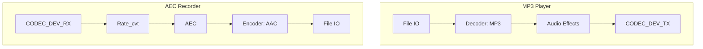

# Play Music from SDCard While Recording Audio with AEC

- [中文版](./README_CN.md)

## Example Brief

This example uses two pipelines to demonstrate the audio recording effect of AEC. One pipeline reads MP3 files stored on the SD card using File IO, then decodes the data through a decoder element. After decoding, the data undergoes audio effect processing and is output as music through the CODEC_DEV_TX IO. Simultaneously, another pipeline uses CODEC_DEV_RX IO to read PCM data from the I2S device, processes it with AEC, encodes the audio, and finally saves it as a file using File IO

This example supports compressing the audio processed by AEC into the `AAC` format, which can be enabled through the macro `ENCODER_ENABLE` in [main.c](./main/main.c):

```c
#define ENCODER_ENABLE (false)
```

- `ENCODER_ENABLE`: Enabling this option will activate the `AAC` encoder in the recording pipeline and save the encoded data as `aec.aac`

## GMF Pipeline

Below is the diagram of the pipelines used in this example:



## AEC Element Initialization Example

```c
esp_gmf_element_handle_t gmf_aec_handle = NULL;
esp_gmf_aec_cfg_t gmf_aec_cfg = {
    .filter_len = 4,
    .type = AFE_TYPE_VC,
    .mode = AFE_MODE_HIGH_PERF,
    .input_format = "RMNM",
};
esp_gmf_aec_init(&gmf_aec_cfg, &gmf_aec_handle);
```

### Parameter Explanation

- `filter_len`: Filter length. Higher values increase CPU load. For `esp32s3` and `esp32p4`, a filter length of 4 is recommended. For `esp32c5`, a filter length of 2 is recommended
- `type`: AEC type, with the following options:
  - `AFE_TYPE_VC`: Suitable for voice communication echo cancellation
  - `AFE_TYPE_SR`: Suitable for voice recognition echo cancellation
- `mode`: AEC mode, with the following options:
  - `AFE_MODE_LOW_POWER`: Low-power mode, suitable for power-sensitive scenarios
  - `AFE_MODE_HIGH_PERF`: High-performance mode, suitable for scenarios requiring high-quality echo cancellation
- `input_format`: Input data format, such as `RMNM`:
  - `M`: Microphone channel
  - `R`: Reference signal channel
  - `N`: Invalid signal

By configuring these parameters, you can adjust the performance and resource usage of AEC according to specific application scenarios. Once added to the `GMF Pool`, the AEC element can be used in the `GMF Pipeline` to process audio streams

## Example Set Up

### Default IDF Branch

This example supports IDF release/v5.3 and later branches

### Build and Flash

Before compiling this example, ensure that the ESP-IDF environment is properly configured. If it is already set up, you can proceed to the next configuration step. If not, run the following script in the root directory of ESP-IDF to set up the build environment. For detailed steps on configuring and using ESP-IDF, please refer to the [ESP-IDF Programming Guide](https://docs.espressif.com/projects/esp-idf/en/latest/esp32s3/index.html)

```
./install.sh
. ./export.sh
```

Here are the summarized steps for compilation:

- Enter the location where the test project is stored:

```
cd gmf_ai_audio/examples/aec_rec
```

- Select the target chip for compilation. For example, to use the ESP32S3:

```
idf.py set-target esp32s3
```
- Select the compilation board, taking ESP32-S3-Korvo V2 as an example:

```
idf.py menuconfig
In 'menuconfig', select 'GMF APP Configuration' -> 'Audio Board' -> 'ESP32-S3-Korvo V2', and then save and exit
```

- Build the example:

```
idf.py build
```

- Flash the program and run the monitor tool to view serial output (replace PORT with the port name):

```
idf.py -p PORT flash monitor
```

- Exit the debugging interface using ``Ctrl-]``

## How to Use the Example

- This example requires an SDCard. Prepare an MP3 file and store it on the SDCard
- Before compiling the program, modify the value of `ENCODER_ENABLE` in `main.c` to enable or disable the `AAC` encoder
- Before running the example, ensure the SDCard is correctly installed on the development board
- During the example's execution, you can speak to the development board to verify the AEC effect later
- After the example finishes running, you can export the files from the SDCard and use software to check the recording content:
  - If encoding is disabled, the recording file will be named `aec_16k_16bit_1ch.pcm` with a format of 16K sampling rate, 16-bit width, and 1 channel
  - If encoding is enabled, the recording file will be named `aec.aac`

### Example Functionality

- Once the example starts running, it will read MP3 audio from the SDCard and play it while recording and saving to the SDCard. After 20 seconds, it will stop and exit, printing the following:

```c
I (926) gpio: GPIO[15]| InputEn: 0| OutputEn: 0| OpenDrain: 0| Pullup: 1| Pulldown: 0| Intr:0
I (935) gpio: GPIO[7]| InputEn: 0| OutputEn: 0| OpenDrain: 0| Pullup: 1| Pulldown: 0| Intr:0
I (944) gpio: GPIO[4]| InputEn: 0| OutputEn: 0| OpenDrain: 0| Pullup: 1| Pulldown: 0| Intr:0
I (995) gpio: GPIO[17]| InputEn: 1| OutputEn: 1| OpenDrain: 1| Pullup: 1| Pulldown: 0| Intr:0
I (996) gpio: GPIO[18]| InputEn: 1| OutputEn: 1| OpenDrain: 1| Pullup: 1| Pulldown: 0| Intr:0
I (1010) ES8311: Work in Slave mode
I (1013) gpio: GPIO[48]| InputEn: 0| OutputEn: 1| OpenDrain: 0| Pullup: 0| Pulldown: 0| Intr:0
E (1017) i2s_common: i2s_channel_disable(1116): the channel has not been enabled yet
I (1025) I2S_IF: channel mode 0 bits:32/32 channel:2 mask:3
I (1031) I2S_IF: STD Mode 1 bits:32/32 channel:2 sample_rate:48000 mask:3
I (1053) Adev_Codec: Open codec device OK
I (1057) ES7210: Work in Slave mode
I (1063) ES7210: Enable ES7210_INPUT_MIC1
I (1066) ES7210: Enable ES7210_INPUT_MIC2
I (1069) ES7210: Enable ES7210_INPUT_MIC3
I (1072) ES7210: Enable TDM mode
E (1077) i2s_common: i2s_channel_disable(1116): the channel has not been enabled yet
I (1078) I2S_IF: channel mode 0 bits:32/32 channel:2 mask:3
I (1085) I2S_IF: STD Mode 0 bits:32/32 channel:2 sample_rate:48000 mask:3
I (1093) ES7210: Bits 16
I (1102) ES7210: Enable ES7210_INPUT_MIC1
I (1105) ES7210: Enable ES7210_INPUT_MIC2
I (1108) ES7210: Enable ES7210_INPUT_MIC3
I (1112) ES7210: Enable TDM mode
I (1118) ES7210: Unmuted
I (1118) Adev_Codec: Open codec device OK
I (1123) ESP_GMF_POOL: Registered items on pool:0x3c23ddf8, app_main-142
I (1129) ESP_GMF_POOL: IO, Item:0x3c23decc, H:0x3c23de0c, TAG:io_http
I (1135) ESP_GMF_POOL: IO, Item:0x3c23df9c, H:0x3c23dedc, TAG:io_http
I (1142) ESP_GMF_POOL: IO, Item:0x3c23e038, H:0x3c23dfac, TAG:io_file
I (1149) ESP_GMF_POOL: IO, Item:0x3c23e0d4, H:0x3c23e048, TAG:io_file
I (1156) ESP_GMF_POOL: IO, Item:0x3c23e204, H:0x3c23e170, TAG:io_embed_flash
I (1163) ESP_GMF_POOL: IO, Item:0x3c23ede0, H:0x3c23ed50, TAG:io_codec_dev
I (1171) ESP_GMF_POOL: IO, Item:0x3c23ee80, H:0x3c23edf0, TAG:io_codec_dev
I (1178) ESP_GMF_POOL: EL, Item:0x3c23e160, H:0x3c23e0e4, TAG:copier
I (1185) ESP_GMF_POOL: EL, Item:0x3c23e2e8, H:0x3c23e214, TAG:aud_enc
I (1193) ESP_GMF_POOL: EL, Item:0x3c23e3e8, H:0x3c23e2f8, TAG:aud_dec
I (1200) ESP_GMF_POOL: EL, Item:0x3c23e4bc, H:0x3c23e3f8, TAG:aud_alc
I (1207) ESP_GMF_POOL: EL, Item:0x3c23e570, H:0x3c23e4cc, TAG:aud_eq
I (1214) ESP_GMF_POOL: EL, Item:0x3c23e5a4, H:0x3c23e6d8, TAG:aud_ch_cvt
I (1221) ESP_GMF_POOL: EL, Item:0x3c23e5d4, H:0x3c23e774, TAG:aud_bit_cvt
I (1228) ESP_GMF_POOL: EL, Item:0x3c23e8ac, H:0x3c23e810, TAG:aud_rate_cvt
I (1235) ESP_GMF_POOL: EL, Item:0x3c23e988, H:0x3c23e8bc, TAG:aud_fade
I (1242) ESP_GMF_POOL: EL, Item:0x3c23ea84, H:0x3c23e998, TAG:aud_sonic
I (1249) ESP_GMF_POOL: EL, Item:0x3c23eb64, H:0x3c23ea94, TAG:aud_deintlv
I (1256) ESP_GMF_POOL: EL, Item:0x3c23ec40, H:0x3c23eb74, TAG:aud_intlv
I (1264) ESP_GMF_POOL: EL, Item:0x3c23ed40, H:0x3c23ec50, TAG:aud_mixer
I (1271) ESP_GMF_POOL: EL, Item:0x3c23ef60, H:0x3c23ee90, TAG:ai_aec
W (1278) ESP_GMF_PIPELINE: There is no thread for add jobs, pipe:0x3c23ef70, tsk:0x0, [el:aud_rate_cvt-0x3c23efa8]
I (1288) ESP_GMF_THREAD: The TSK_0x3fcb5404 created on internal memory
I (1288) ESP_GMF_TASK: Waiting to run... [tsk:TSK_0x3fcb5404-0x3fcb5404, wk:0x0, run:0]
I (1304) AEC_EL_2_FILE: CB: RECV Pipeline EVT: el:NULL-0x3c23ef70, type:8192, sub:ESP_GMF_EVENT_STATE_OPENING, payload:0x0, size:0,0x0
I (1328) ESP_GMF_PORT: ACQ IN, new self payload:0x3c23f35c, port:0x3c23f2a8, el:0x3c23efa8-aud_rate_cvt
I (1329) ESP_GMF_PORT: ACQ OUT SET, new self payload:0x3c23fe68, p:0x3c23f1a8, el:0x3c23efa8-aud_rate_cvt
I (1358) GMF_AEC: GMF AEC open, frame_len: 2048, nch 4, chunksize 256
I (1359) AEC_EL_2_FILE: CB: RECV Pipeline EVT: el:ai_aec-0x3c23f0c4, type:12288, sub:ESP_GMF_EVENT_STATE_INITIALIZED, payload:0x3fcb6790, size:12,0x0
I (1371) AEC_EL_2_FILE: CB: RECV Pipeline EVT: el:ai_aec-0x3c23f0c4, type:8192, sub:ESP_GMF_EVENT_STATE_RUNNING, payload:0x0, size:0,0x0
I (1383) ESP_GMF_TASK: One times job is complete, del[wk:0x3c23f3dc,ctx:0x3c23f0c4, label:aec_open]
I (1401) ESP_GMF_TASK: Waiting to run... [tsk:TSK_0x3fcca2f8-0x3fcca2f8, wk:0x0, run:0]
I (1401) ESP_GMF_THREAD: The TSK_0x3fcca2f8 created on internal memory
I (1432) ESP_GMF_TASK: Waiting to run... [tsk:TSK_0x3fcca2f8-0x3fcca2f8, wk:0x3c252ac0, run:0]
I (1433) ESP_GMF_FILE: Open, dir:1, uri:/sdcard/test.mp3
I (1446) ESP_GMF_FILE: File size: 2994349 byte, file position: 0
I (1447) AEC_EL_2_FILE: CB: RECV Pipeline EVT: el:NULL-0x3c25230c, type:8192
I (1460) ESP_GMF_TASK: One times job is complete, del[wk:0x3c252ac0,ctx:0x3c252344, label:aud_simp_dec_open]
I (1469) ESP_GMF_PORT: ACQ IN, new self payload:0x3c252ac0, port:0x3c252964, el:0x3c252344-aud_dec
I (1482) ESP_GMF_PORT: ACQ OUT SET, new self payload:0x3c252d64, p:0x3c25252c, el:0x3c252344-aud_dec
W (1491) ESP_GMF_ASMP_DEC: Not enough memory for out, need:4608, old: 1024, new: 4608
I (1505) ESP_GMF_ASMP_DEC: NOTIFY Info, rate: 0, bits: 0, ch: 0 --> rate: 44100, bits: 16, ch: 2
Audio >
I (1589) ESP_GMF_TASK: One times job is complete, del[wk:0x3c253fa4,ctx:0x3c252420, label:rate_cvt_open]
I (1590) ESP_GMF_PORT: ACQ OUT SET, new self payload:0x3c253fa4, p:0x3c2526c4, el:0x3c252420-aud_rate_cvt
I (1603) ESP_GMF_TASK: One times job is complete, del[wk:0x3c253fec,ctx:0x3c2525ac, label:ch_cvt_open]
I (1615) AEC_EL_2_FILE: CB: RECV Pipeline EVT: el:aud_bit_cvt-0x3c252744, type:12288, sub:ESP_GMF_EVENT_STATE_INITIALIZED, payload:0x3fccb680, size:12,0x0
I (1627) AEC_EL_2_FILE: CB: RECV Pipeline EVT: el:aud_bit_cvt-0x3c252744, type:8192, sub:ESP_GMF_EVENT_STATE_RUNNING, payload:0x0, size:0,0x0
I (1639) ESP_GMF_TASK: One times job is complete, del[wk:0x3c255608,ctx:0x3c252744, label:bit_cvt_open]
I (1651) ESP_GMF_PORT: ACQ OUT, new self payload:0x3c255608, port:0x3c252a34, el:0x3c252744-aud_bit_cvt
I (21462) ESP_GMF_CODEC_DEV: CLose, 0x3c23f228, pos = 7716864/0
I (21464) ESP_GMF_TASK: One times job is complete, del[wk:0x3c23f410,ctx:0x3c23efa8, label:rate_cvt_close]
I (21478) ESP_GMF_TASK: One times job is complete, del[wk:0x3c253fec,ctx:0x3c23f0c4, label:aec_close]
I (21479) AEC_EL_2_FILE: CB: RECV Pipeline EVT: el:NULL-0x3c23ef70, type:8192, sub:ESP_GMF_EVENT_STATE_STOPPED, payload:0x0, size:0,0x0
I (21501) ESP_GMF_TASK: Waiting to run... [tsk:TSK_0x3fcb5404-0x3fcb5404, wk:0x0, run:0]
I (21502) ESP_GMF_TASK: Waiting to run... [tsk:TSK_0x3fcb5404-0x3fcb5404, wk:0x0, run:0]
I (21514) ESP_GMF_FILE: CLose, 0x3c2528d8, pos = 318464/2994349
I (21525) ESP_GMF_CODEC_DEV: CLose, 0x3c2529a4, pos = 7633608/0
I (21526) ESP_GMF_TASK: One times job is complete, del[wk:0x3c25562c,ctx:0x3c252344, label:aud_simp_dec_close]
I (21538) ESP_GMF_TASK: One times job is complete, del[wk:0x3c23f410,ctx:0x3c252420, label:rate_cvt_close]
I (21549) ESP_GMF_TASK: One times job is complete, del[wk:0x3c23f380,ctx:0x3c2525ac, label:ch_cvt_close]
I (21561) ESP_GMF_TASK: One times job is complete, del[wk:0x3c23f3b8,ctx:0x3c252744, label:bit_cvt_close]
I (21572) AEC_EL_2_FILE: CB: RECV Pipeline EVT: el:NULL-0x3c25230c, type:8192, sub:ESP_GMF_EVENT_STATE_STOPPED, payload:0x0, size:0,0x0
I (21584) ESP_GMF_TASK: Waiting to run... [tsk:TSK_0x3fcca2f8-0x3fcca2f8, wk:0x0, run:0]
I (21595) ESP_GMF_TASK: Waiting to run... [tsk:TSK_0x3fcca2f8-0x3fcca2f8, wk:0x0, run:0]
E (25298) i2s_common: i2s_channel_disable(1116): the channel has not been enabled yet
E (25303) i2s_common: i2s_channel_disable(1116): the channel has not been enabled yet
I (25314) main_task: Returned from app_main()
```

## Troubleshooting

### 1. SDCard Not Recognized

- Ensure the SDCard is formatted as FAT32
- Check if the SDCard is properly inserted into the development board

### 2. MP3 File Not Playing

- Ensure the MP3 file is stored in the root directory of the SDCard
- Verify that the MP3 file is not corrupted
- Ensure the MP3 file is named `test.mp3`

### 3. No Audio Recorded

- Verify that the microphone hardware on the development board is functioning correctly
- Ensure the audio channel configuration matches the hardware design

### 4. High CPU Usage with AEC in the Pipeline

Since the AEC algorithm requires significant CPU resources, consider the following steps if issues arise:

- Identify CPU-intensive elements in the pipeline, such as `ai_aec`, `aud_enc`, or `io_file`
- Split the problematic pipeline into two separate pipelines, run them on different CPU cores, and connect them using `gmf port`
