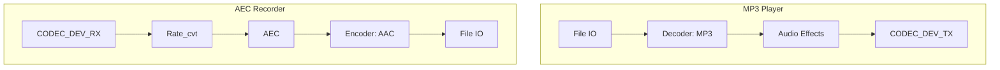

# 播放 SDCard 音乐同时 AEC 录制音频

- [English](./README.md)

## 例程简介

本例程使用两路 pipeline 演示 AEC 录制音频的效果。一路 pipeline 使用 File IO 读取存储在 SDCard 中的 MP3 文件，然后经过 decoder 元素解码，解码后数据进行音频效果处理后用 CODEC_DEV_TX IO 输出音乐。同时，另外一路 pipeline 使用 CODEC_DEV_RX IO 从 I2S 设备读取 PCM 数据，经过 AEC 处理后进行音频编码，最终通过 File IO 保存为文件

本例程支持将 AEC 处理后的音频压缩为 `AAC` 格式，通过 [main.c](./main/main.c) 中的宏 `ENCODER_ENABLE` 使能

```c
#define ENCODER_ENABLE (false)
```

- `ENCODER_ENABLE`: 使能该选项将会在录音的 pipeline 中使能 `AAC` 编码器，并保存编码后的数据为 `aec.aac`

## GMF Pipeline

以下是本例程中使用的 pipeline 的示意图：



## AEC 元素初始化示例

```c
esp_gmf_element_handle_t gmf_aec_handle = NULL;
esp_gmf_aec_cfg_t gmf_aec_cfg = {
    .filter_len = 4,
    .type = AFE_TYPE_VC,
    .mode = AFE_MODE_HIGH_PERF,
    .input_format = "RMNM",
};
esp_gmf_aec_init(&gmf_aec_cfg, &gmf_aec_handle);
```

#### 参数说明

- `filter_len`: 滤波器长度。数值越大，CPU 负载越高。对于 esp32s3 和 esp32p4，建议 filter_length = 4。对于 esp32c5，建议 filter_length = 2
- `type`: AEC 类型，支持以下选项：
  - `AFE_TYPE_VC`: 适用于语音通信的回声消除
  - `AFE_TYPE_SR`: 适用于语音识别的回声消除
- `mode`: AEC 模式，支持以下选项：
  - `AFE_MODE_LOW_POWER`: 低功耗模式，适用于功耗敏感的场景
  - `AFE_MODE_HIGH_PERF`: 高性能模式，适用于需要高质量回声消除的场景
- `input_format`: 输入数据的格式, 如 `RMNM`：
  - `M`：麦克风通道
  - `R`：回采信号通道
  - `N`：无效信号

通过配置这些参数，可以根据具体应用场景调整 AEC 的性能和资源使用。添加到 `GMF Pool` 中后，可在 `GMF Pipeline` 中使用 AEC 处理音频流

## 示例创建

### IDF 默认分支

本例程支持 IDF release/v5.3 及以后的分支

### 编译和下载

编译本例程前需要先确保已配置 ESP-IDF 的环境，如果已配置可跳到下一项配置，如果未配置需要先在 ESP-IDF 根目录运行下面脚本设置编译环境，有关配置和使用 ESP-IDF 完整步骤，请参阅 [《ESP-IDF 编程指南》](https://docs.espressif.com/projects/esp-idf/zh_CN/latest/esp32s3/index.html)

```
./install.sh
. ./export.sh
```

下面是简略编译步骤：

- 进入示例工程的位置

```
cd gmf_ai_audio/examples/aec_rec
```

- 选择编译芯片，以 esp32s3 为例：

```
idf.py set-target esp32s3
```
- 选择编译目标板，以 ESP32-S3-Korvo V2 为例：

```
idf.py menuconfig
在 `menuconfig` 中选择 `GMF APP Configuration` -> `Audio Board` -> `ESP32-S3-Korvo V2`，然后保存退出
```

- 编译例子程序

```
idf.py build
```

- 烧录程序并运行 monitor 工具来查看串口输出 (替换 PORT 为端口名称)：

```
idf.py -p PORT flash monitor
```

- 退出调试界面使用 ``Ctrl-]``

## 如何使用例程

- 本例程需要 SDCard 和 MP3 文件，用户需准备一份 MP3 文件并存入 SDCard 中
- 编译程序前，可以通过 `main.c` 中的 `ENCODER_ENABLE` 的值来决定是否启用 `AAC` 编码
- 运行例程前，请确保 SDCard 已正确安装到开发板上
- 运行例程时，用户可以对开发板说话，以便后续验证 AEC 效果
- 运行结束后，用户可以将 SDCard 中的文件导出，用软件查看录音内容：
  - 如果未启用编码，录音文件名为 `aec_16k_16bit_1ch.pcm`，格式为 16K 采样率，16 bit 位宽，单声道
  - 如果启用编码，录音文件名为 `aec.aac`

### 功能和用法

- 例程运行后，将从 SDCard 中读取 MP3 音频进行播放，同时录音并保存到 SDCard。运行 20 秒后停止并退出，串口打印如下日志：

```c
I (926) gpio: GPIO[15]| InputEn: 0| OutputEn: 0| OpenDrain: 0| Pullup: 1| Pulldown: 0| Intr:0
I (935) gpio: GPIO[7]| InputEn: 0| OutputEn: 0| OpenDrain: 0| Pullup: 1| Pulldown: 0| Intr:0
I (944) gpio: GPIO[4]| InputEn: 0| OutputEn: 0| OpenDrain: 0| Pullup: 1| Pulldown: 0| Intr:0
I (995) gpio: GPIO[17]| InputEn: 1| OutputEn: 1| OpenDrain: 1| Pullup: 1| Pulldown: 0| Intr:0
I (996) gpio: GPIO[18]| InputEn: 1| OutputEn: 1| OpenDrain: 1| Pullup: 1| Pulldown: 0| Intr:0
I (1010) ES8311: Work in Slave mode
I (1013) gpio: GPIO[48]| InputEn: 0| OutputEn: 1| OpenDrain: 0| Pullup: 0| Pulldown: 0| Intr:0
E (1017) i2s_common: i2s_channel_disable(1116): the channel has not been enabled yet
I (1025) I2S_IF: channel mode 0 bits:32/32 channel:2 mask:3
I (1031) I2S_IF: STD Mode 1 bits:32/32 channel:2 sample_rate:48000 mask:3
I (1053) Adev_Codec: Open codec device OK
I (1057) ES7210: Work in Slave mode
I (1063) ES7210: Enable ES7210_INPUT_MIC1
I (1066) ES7210: Enable ES7210_INPUT_MIC2
I (1069) ES7210: Enable ES7210_INPUT_MIC3
I (1072) ES7210: Enable TDM mode
E (1077) i2s_common: i2s_channel_disable(1116): the channel has not been enabled yet
I (1078) I2S_IF: channel mode 0 bits:32/32 channel:2 mask:3
I (1085) I2S_IF: STD Mode 0 bits:32/32 channel:2 sample_rate:48000 mask:3
I (1093) ES7210: Bits 16
I (1102) ES7210: Enable ES7210_INPUT_MIC1
I (1105) ES7210: Enable ES7210_INPUT_MIC2
I (1108) ES7210: Enable ES7210_INPUT_MIC3
I (1112) ES7210: Enable TDM mode
I (1118) ES7210: Unmuted
I (1118) Adev_Codec: Open codec device OK
I (1123) ESP_GMF_POOL: Registered items on pool:0x3c23ddf8, app_main-142
I (1129) ESP_GMF_POOL: IO, Item:0x3c23decc, H:0x3c23de0c, TAG:io_http
I (1135) ESP_GMF_POOL: IO, Item:0x3c23df9c, H:0x3c23dedc, TAG:io_http
I (1142) ESP_GMF_POOL: IO, Item:0x3c23e038, H:0x3c23dfac, TAG:io_file
I (1149) ESP_GMF_POOL: IO, Item:0x3c23e0d4, H:0x3c23e048, TAG:io_file
I (1156) ESP_GMF_POOL: IO, Item:0x3c23e204, H:0x3c23e170, TAG:io_embed_flash
I (1163) ESP_GMF_POOL: IO, Item:0x3c23ede0, H:0x3c23ed50, TAG:io_codec_dev
I (1171) ESP_GMF_POOL: IO, Item:0x3c23ee80, H:0x3c23edf0, TAG:io_codec_dev
I (1178) ESP_GMF_POOL: EL, Item:0x3c23e160, H:0x3c23e0e4, TAG:copier
I (1185) ESP_GMF_POOL: EL, Item:0x3c23e2e8, H:0x3c23e214, TAG:aud_enc
I (1193) ESP_GMF_POOL: EL, Item:0x3c23e3e8, H:0x3c23e2f8, TAG:aud_dec
I (1200) ESP_GMF_POOL: EL, Item:0x3c23e4bc, H:0x3c23e3f8, TAG:aud_alc
I (1207) ESP_GMF_POOL: EL, Item:0x3c23e570, H:0x3c23e4cc, TAG:aud_eq
I (1214) ESP_GMF_POOL: EL, Item:0x3c23e5a4, H:0x3c23e6d8, TAG:aud_ch_cvt
I (1221) ESP_GMF_POOL: EL, Item:0x3c23e5d4, H:0x3c23e774, TAG:aud_bit_cvt
I (1228) ESP_GMF_POOL: EL, Item:0x3c23e8ac, H:0x3c23e810, TAG:aud_rate_cvt
I (1235) ESP_GMF_POOL: EL, Item:0x3c23e988, H:0x3c23e8bc, TAG:aud_fade
I (1242) ESP_GMF_POOL: EL, Item:0x3c23ea84, H:0x3c23e998, TAG:aud_sonic
I (1249) ESP_GMF_POOL: EL, Item:0x3c23eb64, H:0x3c23ea94, TAG:aud_deintlv
I (1256) ESP_GMF_POOL: EL, Item:0x3c23ec40, H:0x3c23eb74, TAG:aud_intlv
I (1264) ESP_GMF_POOL: EL, Item:0x3c23ed40, H:0x3c23ec50, TAG:aud_mixer
I (1271) ESP_GMF_POOL: EL, Item:0x3c23ef60, H:0x3c23ee90, TAG:ai_aec
W (1278) ESP_GMF_PIPELINE: There is no thread for add jobs, pipe:0x3c23ef70, tsk:0x0, [el:aud_rate_cvt-0x3c23efa8]
I (1288) ESP_GMF_THREAD: The TSK_0x3fcb5404 created on internal memory
I (1288) ESP_GMF_TASK: Waiting to run... [tsk:TSK_0x3fcb5404-0x3fcb5404, wk:0x0, run:0]
I (1304) AEC_EL_2_FILE: CB: RECV Pipeline EVT: el:NULL-0x3c23ef70, type:8192, sub:ESP_GMF_EVENT_STATE_OPENING, payload:0x0, size:0,0x0
I (1328) ESP_GMF_PORT: ACQ IN, new self payload:0x3c23f35c, port:0x3c23f2a8, el:0x3c23efa8-aud_rate_cvt
I (1329) ESP_GMF_PORT: ACQ OUT SET, new self payload:0x3c23fe68, p:0x3c23f1a8, el:0x3c23efa8-aud_rate_cvt
I (1358) GMF_AEC: GMF AEC open, frame_len: 2048, nch 4, chunksize 256
I (1359) AEC_EL_2_FILE: CB: RECV Pipeline EVT: el:ai_aec-0x3c23f0c4, type:12288, sub:ESP_GMF_EVENT_STATE_INITIALIZED, payload:0x3fcb6790, size:12,0x0
I (1371) AEC_EL_2_FILE: CB: RECV Pipeline EVT: el:ai_aec-0x3c23f0c4, type:8192, sub:ESP_GMF_EVENT_STATE_RUNNING, payload:0x0, size:0,0x0
I (1383) ESP_GMF_TASK: One times job is complete, del[wk:0x3c23f3dc,ctx:0x3c23f0c4, label:aec_open]
I (1401) ESP_GMF_TASK: Waiting to run... [tsk:TSK_0x3fcca2f8-0x3fcca2f8, wk:0x0, run:0]
I (1401) ESP_GMF_THREAD: The TSK_0x3fcca2f8 created on internal memory
I (1432) ESP_GMF_TASK: Waiting to run... [tsk:TSK_0x3fcca2f8-0x3fcca2f8, wk:0x3c252ac0, run:0]
I (1433) ESP_GMF_FILE: Open, dir:1, uri:/sdcard/test.mp3
I (1446) ESP_GMF_FILE: File size: 2994349 byte, io_file position: 0
I (1447) AEC_EL_2_FILE: CB: RECV Pipeline EVT: el:NULL-0x3c25230c, type:8192
I (1460) ESP_GMF_TASK: One times job is complete, del[wk:0x3c252ac0,ctx:0x3c252344, label:aud_simp_dec_open]
I (1469) ESP_GMF_PORT: ACQ IN, new self payload:0x3c252ac0, port:0x3c252964, el:0x3c252344-aud_dec
I (1482) ESP_GMF_PORT: ACQ OUT SET, new self payload:0x3c252d64, p:0x3c25252c, el:0x3c252344-aud_dec
W (1491) ESP_GMF_ASMP_DEC: Not enough memory for out, need:4608, old: 1024, new: 4608
I (1505) ESP_GMF_ASMP_DEC: NOTIFY Info, rate: 0, bits: 0, ch: 0 --> rate: 44100, bits: 16, ch: 2
Audio >
I (1589) ESP_GMF_TASK: One times job is complete, del[wk:0x3c253fa4,ctx:0x3c252420, label:rate_cvt_open]
I (1590) ESP_GMF_PORT: ACQ OUT SET, new self payload:0x3c253fa4, p:0x3c2526c4, el:0x3c252420-aud_rate_cvt
I (1603) ESP_GMF_TASK: One times job is complete, del[wk:0x3c253fec,ctx:0x3c2525ac, label:ch_cvt_open]
I (1615) AEC_EL_2_FILE: CB: RECV Pipeline EVT: el:aud_bit_cvt-0x3c252744, type:12288, sub:ESP_GMF_EVENT_STATE_INITIALIZED, payload:0x3fccb680, size:12,0x0
I (1627) AEC_EL_2_FILE: CB: RECV Pipeline EVT: el:aud_bit_cvt-0x3c252744, type:8192, sub:ESP_GMF_EVENT_STATE_RUNNING, payload:0x0, size:0,0x0
I (1639) ESP_GMF_TASK: One times job is complete, del[wk:0x3c255608,ctx:0x3c252744, label:bit_cvt_open]
I (1651) ESP_GMF_PORT: ACQ OUT, new self payload:0x3c255608, port:0x3c252a34, el:0x3c252744-aud_bit_cvt
I (21462) ESP_GMF_CODEC_DEV: CLose, 0x3c23f228, pos = 7716864/0
I (21464) ESP_GMF_TASK: One times job is complete, del[wk:0x3c23f410,ctx:0x3c23efa8, label:rate_cvt_close]
I (21478) ESP_GMF_TASK: One times job is complete, del[wk:0x3c253fec,ctx:0x3c23f0c4, label:aec_close]
I (21479) AEC_EL_2_FILE: CB: RECV Pipeline EVT: el:NULL-0x3c23ef70, type:8192, sub:ESP_GMF_EVENT_STATE_STOPPED, payload:0x0, size:0,0x0
I (21501) ESP_GMF_TASK: Waiting to run... [tsk:TSK_0x3fcb5404-0x3fcb5404, wk:0x0, run:0]
I (21502) ESP_GMF_TASK: Waiting to run... [tsk:TSK_0x3fcb5404-0x3fcb5404, wk:0x0, run:0]
I (21514) ESP_GMF_FILE: CLose, 0x3c2528d8, pos = 318464/2994349
I (21525) ESP_GMF_CODEC_DEV: CLose, 0x3c2529a4, pos = 7633608/0
I (21526) ESP_GMF_TASK: One times job is complete, del[wk:0x3c25562c,ctx:0x3c252344, label:aud_simp_dec_close]
I (21538) ESP_GMF_TASK: One times job is complete, del[wk:0x3c23f410,ctx:0x3c252420, label:rate_cvt_close]
I (21549) ESP_GMF_TASK: One times job is complete, del[wk:0x3c23f380,ctx:0x3c2525ac, label:ch_cvt_close]
I (21561) ESP_GMF_TASK: One times job is complete, del[wk:0x3c23f3b8,ctx:0x3c252744, label:bit_cvt_close]
I (21572) AEC_EL_2_FILE: CB: RECV Pipeline EVT: el:NULL-0x3c25230c, type:8192, sub:ESP_GMF_EVENT_STATE_STOPPED, payload:0x0, size:0,0x0
I (21584) ESP_GMF_TASK: Waiting to run... [tsk:TSK_0x3fcca2f8-0x3fcca2f8, wk:0x0, run:0]
I (21595) ESP_GMF_TASK: Waiting to run... [tsk:TSK_0x3fcca2f8-0x3fcca2f8, wk:0x0, run:0]
E (25298) i2s_common: i2s_channel_disable(1116): the channel has not been enabled yet
E (25303) i2s_common: i2s_channel_disable(1116): the channel has not been enabled yet
I (25314) main_task: Returned from app_main()
```

## 常见问题

### 1. 无法识别 SDCard

- 确保 SDCard 已正确格式化为 FAT32 文件系统
- 检查 SDCard 是否正确插入开发板

### 2. 无法播放 MP3 文件

- 确保 MP3 文件存储在 SDCard 的根目录中
- 确保 MP3 文件未损坏
- 确保 MP3 文件名为 `test.mp3`

### 3. 录制音频无声音

- 确保开发板的麦克风硬件正常工作
- 确保语音通道配置符合硬件设计

### 4. 集成 AEC 的 Pipeline CPU 占用过高

由于 AEC 算法需要的 cpu 算力较多，所以组建包含 AEC 元素的 Pipeline 时，需合理分配资源，如遇到问题，可按如下方式处理：

- 查看 Pipeline 有哪些需要 cpu 算力较多的元素，如 `ai_aec`, `aud_enc`, `io_file` 等
- 将出现问题的 Pipeline 拆分为两个，分别运行到不同的 cpu 核心上，使用 `gmf port` 连接
