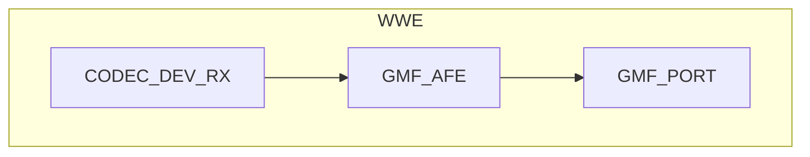

# Speech Recognition

- [中文版](./README_CN.md)

## Example Brief

This example demonstrates how to use the `AFE element` for wake word detection, voice activity detection (VAD), and command word recognition. It allows configuring features through the following macro definitions in [main.c](./main/main.c) to achieve different application combinations:

```c
#define VOICE2FILE     (true)
#define WAKENET_ENABLE (true)
#define VAD_ENABLE     (true)
#define VCMD_ENABLE    (true)
```

- `VOICE2FILE`: Save the audio between VAD start and VAD end as a file
- `WAKENET_ENABLE`: Enable wake word recognition
- `VAD_ENABLE`: Enable voice activity detection
- `VCMD_ENABLE`: Enable command word recognition

## GMF Pipeline



## Example Set Up

### Default IDF Branch

This example supports IDF release/v5.3 and later branches

### Prerequisites

The voice wake word and command word detection used in this example are derived from `esp-sr`. Please familiarize yourself with its configuration and usage: [README](https://github.com/espressif/esp-sr/blob/master/README.md)

### Build and Flash

Before compiling this example, ensure that the ESP-IDF environment is properly configured. If it is already set up, you can proceed to the next configuration step. If not, run the following script in the root directory of ESP-IDF to set up the build environment. For detailed steps on configuring and using ESP-IDF, please refer to the [ESP-IDF Programming Guide](https://docs.espressif.com/projects/esp-idf/en/latest/esp32s3/index.html)

```
./install.sh
. ./export.sh
```

Here are the summarized steps for compilation:

- Enter the location where the example project is stored:

```
cd gmf_ai_audio/examples/wwe
```

- Select the target chip for compilation. For example, to use the ESP32S3:

```
idf.py set-target esp32s3
```
- Select the compilation board, taking ESP32-S3-Korvo V2 as an example:

```
idf.py menuconfig
In 'menuconfig', select 'GMF APP Configuration' -> 'Audio Board' -> 'ESP32-S3-Korvo V2', and then save and exit
```

- Build the example:

```
idf.py build
```

- Flash the program and run the monitor tool to view serial output (replace PORT with the port name):

```
idf.py -p PORT flash monitor
```

- Exit the debugging interface using `Ctrl-]`

## How to use the Example

- Before compiling the program, confirm whether wake word detection is enabled by checking the value of `WAKENET_ENABLE` in `main.c`. Also, confirm whether the `afe` output needs to be saved as a file by checking the value of `VOICE2FILE`
- If `VOICE2FILE` is set to `true`, ensure that the SDCard is correctly installed on the development board before running the example
- During the example's execution, if `WAKENET_ENABLE` is set to `true`, first say the wake word, then say the command word to verify the effects of wake word detection, voice activity detection, and command word detection. If `WAKENET_ENABLE` is set to `false`, you can directly use command words. Pay attention to the corresponding event prompts in the `log`
- If `VOICE2FILE` is set to `true`, after the example finishes running, you can export the files from the SDCard and use software to check the recording content. The recording file names are `16k_16bit_1ch_{idx}.pcm`, where `{idx}` increments. The PCM format is 16K sampling rate, 16-bit width, and 1 channel

### Example Functionality

- After the example starts running, you can say wake words and command words to the development board. The following will be printed:

```c
I (1547) AFE: AFE Version: (2MIC_V250113)
I (1550) AFE: Input PCM Config: total 4 channels(2 microphone, 1 playback), sample rate:16000
I (1560) AFE: AFE Pipeline: [input] -> |AEC(SR_HIGH_PERF)| -> |SE(BSS)| -> |VAD(WebRTC)| -> |WakeNet(wn9_hilexin,)| -> [output]
I (1572) AFE_manager: Feed task, ch 4, chunk 1024, buf size 8192
I (1579) GMF_AFE: Create AFE, ai_afe-0x3c2dcf90
I (1584) GMF_AFE: Create AFE, ai_afe-0x3c2dd0b8
I (1589) GMF_AFE: New an object,ai_afe-0x3c2dd0b8
I (1595) ESP_GMF_TASK: Waiting to run... [tsk:TSK_0x3fcc500c-0x3fcc500c, wk:0x0, run:0]
I (1603) ESP_GMF_THREAD: The TSK_0x3fcc500c created on internal memory
I (1610) ESP_GMF_TASK: Waiting to run... [tsk:TSK_0x3fcc500c-0x3fcc500c, wk:0x3c2dd17c, run:0]
I (1620) AI_AUDIO_WWE: CB: RECV Pipeline EVT: el:NULL-0x3c2dd080, type:8192, sub:ESP_GMF_EVENT_STATE_OPENING, payload:0x0, size:0,0x0
I (1632) AFE_manager: AFE Ctrl [1, 0]
I (1637) AFE_manager: VAD ctrl ret 1
Build fst from commands.
Quantized MultiNet6:rnnt_ctc_1.0, name:mn6_cn, (Feb 18 2025 12:00:53)
Quantized MultiNet6 search method: 2, time out:5.8 s
I (2639) NEW_DATA_BUS: New ringbuffer:0x3c6feeb4, num:2, item_cnt:8192, db:0x3c6e2b3c
I (2643) NEW_DATA_BUS: New ringbuffer:0x3c6fe4d0, num:1, item_cnt:20480, db:0x3c6fcbd8
I (2651) AFE_manager: AFE manager suspend 1
I (2656) AFE_manager: AFE manager suspend 0
I (2661) AI_AUDIO_WWE: CB: RECV Pipeline EVT: el:ai_afe-0x3c2dd0b8, type:12288, sub:ESP_GMF_EVENT_STATE_INITIALIZED, payload:0x3fccd920, size:12,0x0
I (2675) AI_AUDIO_WWE: CB: RECV Pipeline EVT: el:ai_afe-0x3c2dd0b8, type:8192, sub:ESP_GMF_EVENT_STATE_RUNNING, payload:0x0, size:0,0x0
I (2688) ESP_GMF_TASK: One times job is complete, del[wk:0x3c2dd17c,ctx:0x3c2dd0b8, label:gmf_afe_open]
I (2698) ESP_GMF_PORT: ACQ IN, new self payload:0x3c2dd17c, port:0x3c2dd240, el:0x3c2dd0b8-ai_afe

Type 'help' to get the list of commands.
Use UP/DOWN arrows to navigate through command history.
Press TAB when typing command name to auto-complete.
I (2893) ESP_GMF_PORT: ACQ OUT, new self payload:0x3c6fc548, port:0x3c2dd280, el:0x3c2dd0b8-ai_afe
Audio > I (5668) AFE_manager: AFE Ctrl [1, 1]
I (5669) AFE_manager: VAD ctrl ret 1
I (5674) AI_AUDIO_WWE: WAKEUP_START [1 : 1]
I (6334) AI_AUDIO_WWE: VAD_START
W (7833) AI_AUDIO_WWE: Command 25, phrase_id 25, prob 0.998051, str:  da kai kong tiao
I (8110) AI_AUDIO_WWE: VAD_END
I (8128) AI_AUDIO_WWE: File closed
I (10110) AFE_manager: AFE Ctrl [1, 0]
I (10111) AFE_manager: VAD ctrl ret 1
I (10118) AI_AUDIO_WWE: WAKEUP_END
```

### Troubleshooting

1. **Wake Word Not Detected**:
   - Ensure `WAKENET_ENABLE` is set to `true`
   - Verify that the model files are correctly loaded
   - Check if the channel configuration matches the hardware setup

2. **Recording File Not Generated**:
   - Ensure the SD card is correctly installed
   - Verify that `VOICE2FILE` is set to `true`
   - Confirm that speech is detected after wakeup

3. **Task Watchdog Timeout**:
   - Ensure `esp_afe_manager_cfg_t.feed_task_setting.core` and `esp_afe_manager_cfg_t.fetch_task_setting.core` are configured on different CPU cores
   - Properly allocate tasks on the core where the timeout occurs
