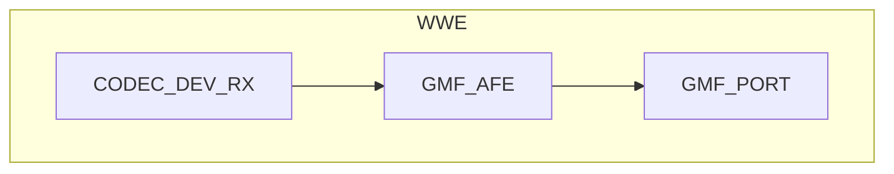

# 语音识别

- [English](./README.md)

## 例程简介

本例程介绍使用 `AFE element` 进行唤醒词、人声检测和命令词检测的方法，并通过 [main.c](./main/main.c) 中的以下宏定义来配置功能，从而实现不同的应用组合：

```c
#define VOICE2FILE     (true)
#define WAKENET_ENABLE (true)
#define VAD_ENABLE     (true)
#define VCMD_ENABLE    (true)
```

- `VOICE2FILE`: 以文件的形式保存 VAD 开始到 VAD 结束之间的音频
- `WAKENET_ENABLE`: 唤醒词识别使能
- `VAD_ENABLE`: 人声检测使能
- `VCMD_ENABLE`: 命令词检测使能

## GMF Pipeline



## 示例创建

### IDF 默认分支

本例程支持 IDF release/v5.3 及以后的分支

### 预备知识

例程中使用的语音唤醒和命令词检测，源自于 `esp-sr`，请先了解其配置和使用: [README](https://github.com/espressif/esp-sr/blob/master/README.md)

### 编译和下载

编译本例程前需要先确保已配置 ESP-IDF 的环境，如果已配置可跳到下一项配置，如果未配置需要先在 ESP-IDF 根目录运行下面脚本设置编译环境，有关配置和使用 ESP-IDF 完整步骤，请参阅 [《ESP-IDF 编程指南》](https://docs.espressif.com/projects/esp-idf/zh_CN/latest/esp32s3/index.html)

```
./install.sh
. ./export.sh
```

下面是简略编译步骤：

- 进入示例工程的位置

```
cd gmf_ai_audio/examples/wwe
```

- 选择编译芯片，以 esp32s3 为例：

```
idf.py set-target esp32s3
```
- 选择编译目标板，以 ESP32-S3-Korvo V2 为例：

```
idf.py menuconfig
在 `menuconfig` 中选择 `GMF APP Configuration` -> `Audio Board` -> `ESP32-S3-Korvo V2`，然后保存退出
```

- 编译例子程序

```
idf.py build
```

- 烧录程序并运行 monitor 工具来查看串口输出 (替换 PORT 为端口名称)：

```
idf.py -p PORT flash monitor
```

- 退出调试界面使用 `Ctrl-]`

## 如何使用例程

1. **配置功能**: 在 `main.c` 中通过上文中说明的宏定义启用或禁用功能来选择对应的应用场景

2. **运行要求**:
   - 如果启用了 `VOICE2FILE`，请确保 SD 卡已正确安装到开发板上
   - 如果启用了 `WAKENET_ENABLE`，运行时需要先说出唤醒词，然后再说命令词
   - 如果关闭了 `WAKENET_ENABLE`，运行时可以直接说命令词

3. **查看结果**:
   - 运行过程中，串口会打印检测到的事件日志
   - 如果启用了 `VOICE2FILE`，录音文件将保存到 SD 卡，文件名格式为 `16k_16bit_1ch_{idx}.pcm`

### 功能和用法

运行后，可以对开发板说唤醒词和命令词，串口会打印如下日志：

```c
I (1547) AFE: AFE Version: (2MIC_V250113)
I (1550) AFE: Input PCM Config: total 4 channels(2 microphone, 1 playback), sample rate:16000
I (1560) AFE: AFE Pipeline: [input] -> |AEC(SR_HIGH_PERF)| -> |SE(BSS)| -> |VAD(WebRTC)| -> |WakeNet(wn9_hilexin,)| -> [output]
I (1572) AFE_manager: Feed task, ch 4, chunk 1024, buf size 8192
I (1579) GMF_AFE: Create AFE, ai_afe-0x3c2dcf90
I (1584) GMF_AFE: Create AFE, ai_afe-0x3c2dd0b8
I (1589) GMF_AFE: New an object,ai_afe-0x3c2dd0b8
I (1595) ESP_GMF_TASK: Waiting to run... [tsk:TSK_0x3fcc500c-0x3fcc500c, wk:0x0, run:0]
I (1603) ESP_GMF_THREAD: The TSK_0x3fcc500c created on internal memory
I (1610) ESP_GMF_TASK: Waiting to run... [tsk:TSK_0x3fcc500c-0x3fcc500c, wk:0x3c2dd17c, run:0]
I (1620) AI_AUDIO_WWE: CB: RECV Pipeline EVT: el:NULL-0x3c2dd080, type:8192, sub:ESP_GMF_EVENT_STATE_OPENING, payload:0x0, size:0,0x0
I (1632) AFE_manager: AFE Ctrl [1, 0]
I (1637) AFE_manager: VAD ctrl ret 1
Build fst from commands.
Quantized MultiNet6:rnnt_ctc_1.0, name:mn6_cn, (Feb 18 2025 12:00:53)
Quantized MultiNet6 search method: 2, time out:5.8 s
I (2639) NEW_DATA_BUS: New ringbuffer:0x3c6feeb4, num:2, item_cnt:8192, db:0x3c6e2b3c
I (2643) NEW_DATA_BUS: New ringbuffer:0x3c6fe4d0, num:1, item_cnt:20480, db:0x3c6fcbd8
I (2651) AFE_manager: AFE manager suspend 1
I (2656) AFE_manager: AFE manager suspend 0
I (2661) AI_AUDIO_WWE: CB: RECV Pipeline EVT: el:ai_afe-0x3c2dd0b8, type:12288, sub:ESP_GMF_EVENT_STATE_INITIALIZED, payload:0x3fccd920, size:12,0x0
I (2675) AI_AUDIO_WWE: CB: RECV Pipeline EVT: el:ai_afe-0x3c2dd0b8, type:8192, sub:ESP_GMF_EVENT_STATE_RUNNING, payload:0x0, size:0,0x0
I (2688) ESP_GMF_TASK: One times job is complete, del[wk:0x3c2dd17c,ctx:0x3c2dd0b8, label:gmf_afe_open]
I (2698) ESP_GMF_PORT: ACQ IN, new self payload:0x3c2dd17c, port:0x3c2dd240, el:0x3c2dd0b8-ai_afe

Type 'help' to get the list of commands.
Use UP/DOWN arrows to navigate through command history.
Press TAB when typing command name to auto-complete.
I (2893) ESP_GMF_PORT: ACQ OUT, new self payload:0x3c6fc548, port:0x3c2dd280, el:0x3c2dd0b8-ai_afe
Audio > I (5668) AFE_manager: AFE Ctrl [1, 1]
I (5669) AFE_manager: VAD ctrl ret 1
I (5674) AI_AUDIO_WWE: WAKEUP_START [1 : 1]
I (6334) AI_AUDIO_WWE: VAD_START
W (7833) AI_AUDIO_WWE: Command 25, phrase_id 25, prob 0.998051, str:  da kai kong tiao
I (8110) AI_AUDIO_WWE: VAD_END
I (8128) AI_AUDIO_WWE: File closed
I (10110) AFE_manager: AFE Ctrl [1, 0]
I (10111) AFE_manager: VAD ctrl ret 1
I (10118) AI_AUDIO_WWE: WAKEUP_END
```

### 常见问题

1. **无法检测唤醒词**:
   - 确保 `WAKENET_ENABLE` 设置为 `true`
   - 检查模型文件是否正确加载
   - 配置的通道顺序是否符合硬件实际

2. **录音文件未生成**:
   - 确保 SD 卡已正确安装。
   - 检查 `VOICE2FILE` 是否设置为 `true`
   - 唤醒后是否有说话

3. **Task Watch Dog**:
   - 确保 `esp_afe_manager_cfg_t.feed_task_setting.core` 和 `esp_afe_manager_cfg_t.fetch_task_setting.core` 配置在不同的 cpu 核心上
   - 将出现 `task wdt` 的核上任务合理分配
