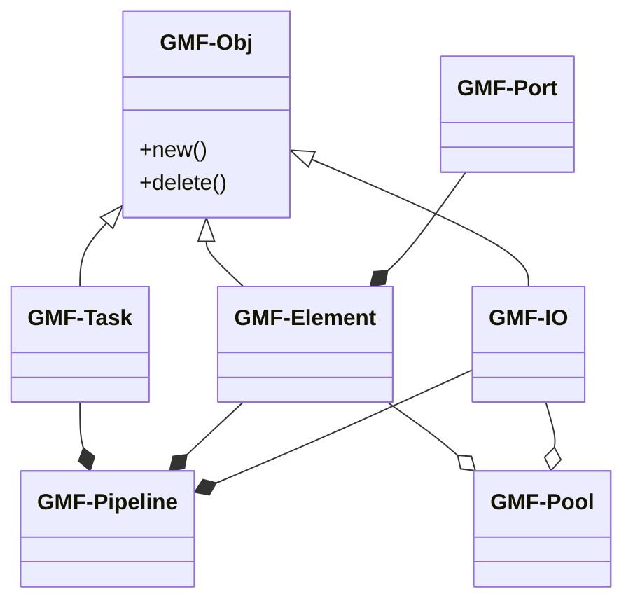
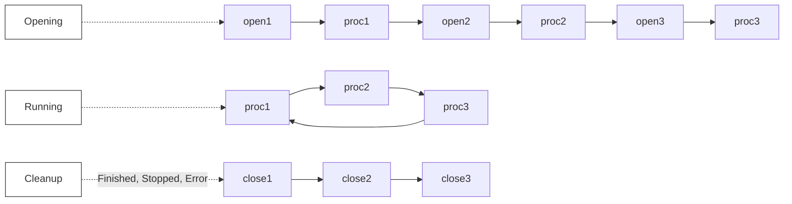
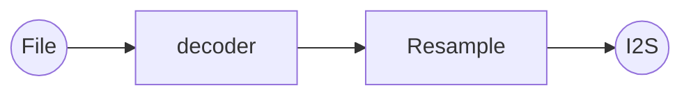
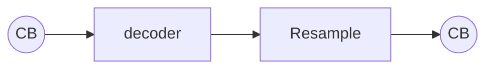
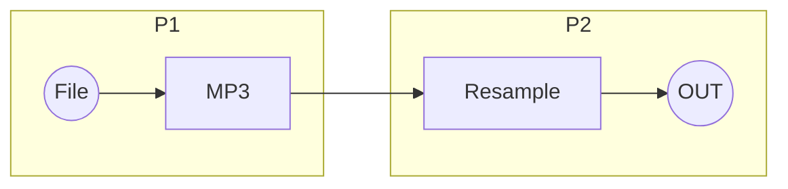
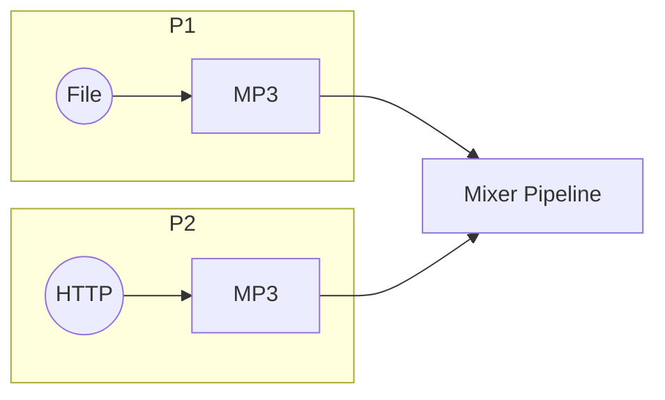
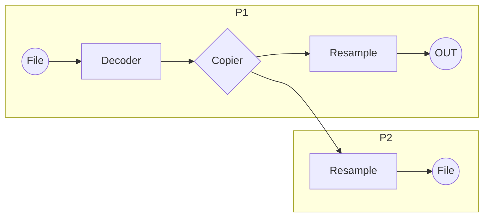
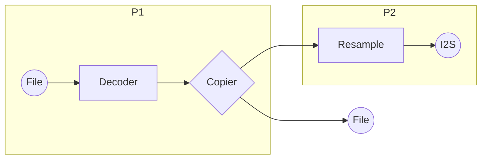
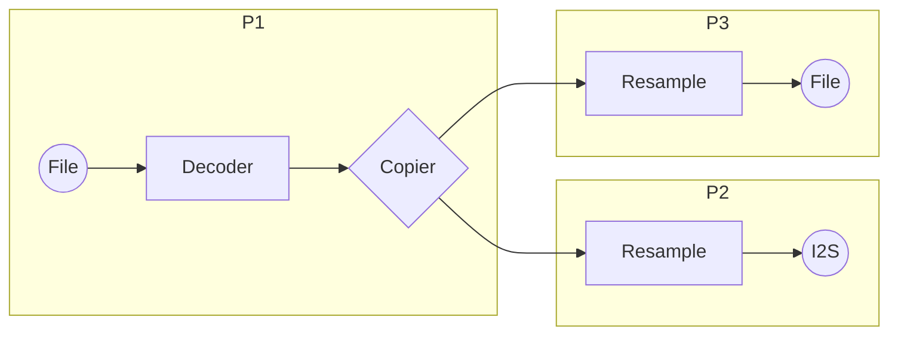

# Overview of the GMF-Core Framework
[中文版](./README_CN.md)

The following diagram illustrates the class relationships within the GMF-Core framework.

`GMF-Obj` is the core class, providing a unified interface for object creation and destruction to manage derived class objects easily. `GMF-IO`, `GMF-Task`, and `GMF-Element` all inherit from it.

GMF-Core primarily comprises `GMF-Element`, `GMF-Pipeline`, and `GMF-Task`. It operates around a unit called a "job," which serves as the smallest processing unit. Each job is loaded and executed in real time.
- **GMF-Element** is the job provider and offers three fundamental jobs: open, process, and close. Typically, open is the first job to load, process follows after open completes, and when all jobs are finished or if an error occurs, the close job loads.
- **GMF-Pipeline** manages and loads the jobs of connected elements, controls the start and stop of `GMF-Task`, and opens and closes the IN and OUT IO interfaces if any.
- **GMF-Task** handles the workflow of jobs as shown below. The task operates in three phases: **opening** (calls each element's open and process jobs once), **running** (repeatedly calls each element's process job based on connection order), and **cleanup** (when jobs complete or an error occurs, it calls the close job for resource release).

## GMF-Pool
`GMF-Pool` is the management unit for `GMF-Element` and `GMF-IO`. It enables the creation of pipelines based on a list of strings, creating object replicas first, then connecting them to form a pipeline. If a new pipeline requires a specific element or IO configuration changes, these adjustments can be made after pipeline creation using `esp_gmf_pipeline_get_el_by_name` and `OBJ_GET_CFG`.

## GMF-Element
`GMF-Element` is a base class designed for implementing specific functional elements. Its derived categories include audio elements, picture elements, and others.

- An **audio element** class may include an encoder, a decoder, and audio processing algorithms like EQ, mixer, and resample.
- A **picture element** class may include a JPEG encoder/decoder, a PNG decoder, etc.

The input and output ports of GMF-Element are represented by GMF-Port. GMF-Port manages the payload buffer based on the connection status of the elements and the requested data size, facilitating the transfer of payload data between elements. GMF-Element is responsible for managing GMF-Port's connection capabilities and the number of connections.

## GMF-DataBus
`GMF-DataBus` is GMF-Core's data access module, which employs an Acquire-Release method for data access. `GMF-DataBus` supports both zero-copy and copy-based data transfer, as well as blocking and non-blocking access modes. Currently, GMF-Core supports four buffer types: `Ringbuffer`, `PBuffer`, `FIFO`, and `BlockBuffer`. `PBuffer`, `FIFO`,  and `BlockBuffer` use zero-copy transfer, while `Ringbuffer`, `FIFO`, and `BlockBuffer` provide blocking interfaces.

## GMF-Task
`GMF-Task` is the thread that executes jobs, taking jobs from a list and running them in serial. Once all jobs in the list have been processed, it enters an idle state until new jobs are added. Jobs are the smallest unit of work and are categorized into single-use jobs or continuous jobs.

## GMF-Pipeline
A `GMF-Pipeline` is composed of elements, tasks, and IO. Each pipeline requires at least one task to manage and schedule jobs. `GMF-Pipeline` supports sequentially cascading pipelines, allowing one pipeline to connect to another and cascade events.

The pipeline also enables ordered startup for elements with event dependencies. For example, if a pipeline consists of a decoder and a resampler, and the resampler requires music data parsed by the decoder, `GMF-Pipeline` will first start only the decoder. Once the decoder has parsed the data, the pipeline will then initiate the resampler. This flow simplifies operations and avoids unnecessary noise.

`GMF-Pipeline` is an independently operable module within GMF and provides users with control interfaces for pipeline operations, such as run, stop, pause, resume, and reset. `GMF-Pipeline` manages the elements and tasks connected to it, as well as the opening and closing of IN and OUT ports. During operation, the pipeline registers and manages jobs for connected elements. A `GMF-Pipeline` typically consists of one GMF-Task, at least one element, a maximum of one IN port, and a maximum of one OUT port. The IN port connects to the input of the first element, and the OUT port connects to the output of the last element. A pipeline can contain one or multiple elements, with no limit on the number of elements, constrained only by physical resource availability.

Below are four basic pipeline application examples.

**Application 1:** A single pipeline decodes audio from a file and plays it through I2S.

**Application 2:** Input and output ports of the pipeline are replaced by callback functions to fetch user-supplied data.

**Application 3:** A single playback pipeline is split into two, connected via `Ringbuffer`.

**Application 4:** Two pipelines are merged into a mixer pipeline for multi-channel mixing.

Complex pipelines are valuable in data distribution scenarios, such as providing audio data to acoustic echo cancellation (AEC) for reference while playing music. The following examples employ a `copier` element with multi-output capabilities, enabling connections to multiple pipelines or outputs.

**Application 1:** Use two pipelines to achieve multi-output from a single input source. The decoded data is forwarded by a copier to an additional pipeline.

**Application 2:** Use two pipelines to achieve multi-output from a single input source. One output is directed through a pipeline, and the other through the port.

**Application 3:** Use three pipelines to achieve multi-output from a single input source. The decoded data is distributed to each subsequent pipeline via `ringbuffer`.

## Usage Instructions

For a simple example of the GMF-Core API, please refer to [test_apps](./test_apps/main/cases/gmf_pool_test.c). For additional practical application examples, check the examples provided in the GMF-Elements.
