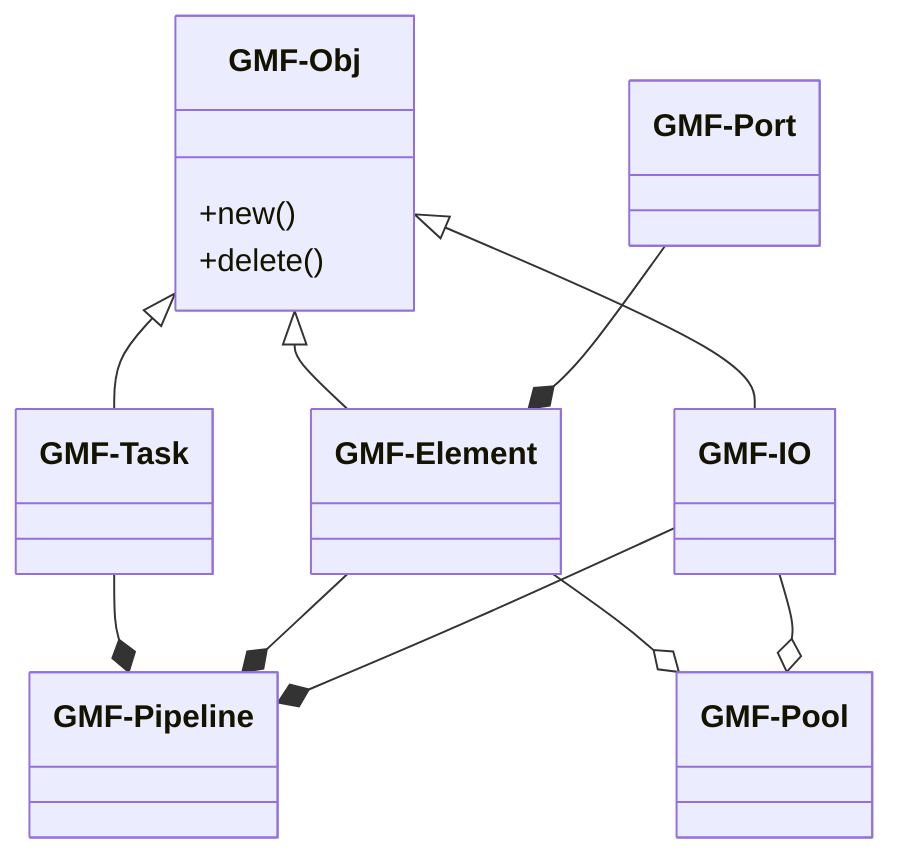
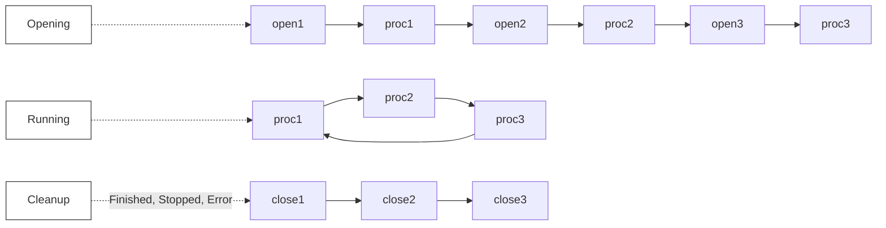
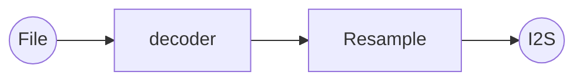
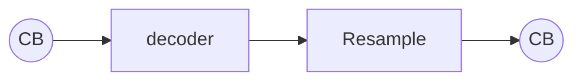
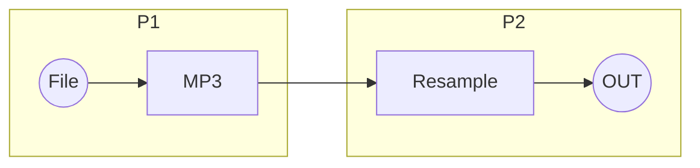
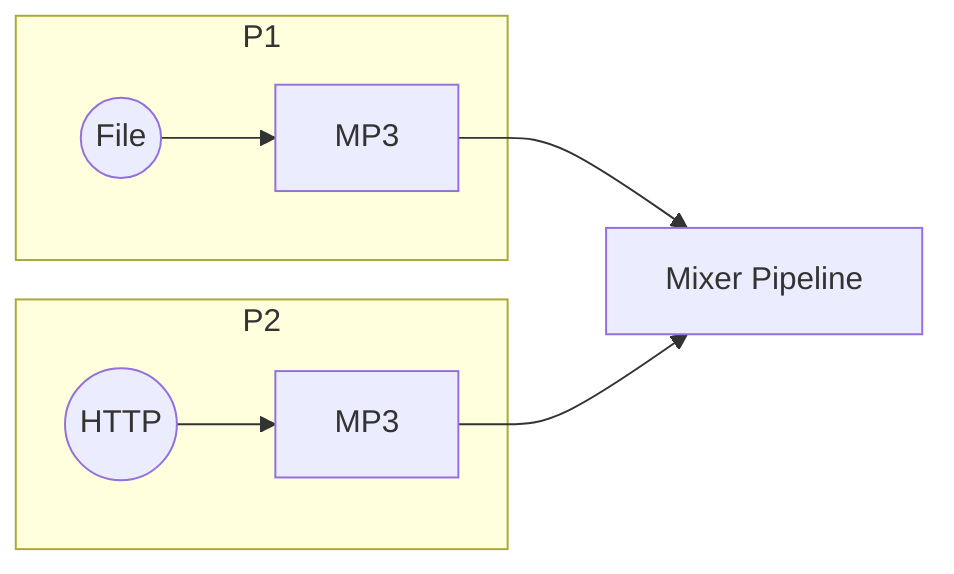
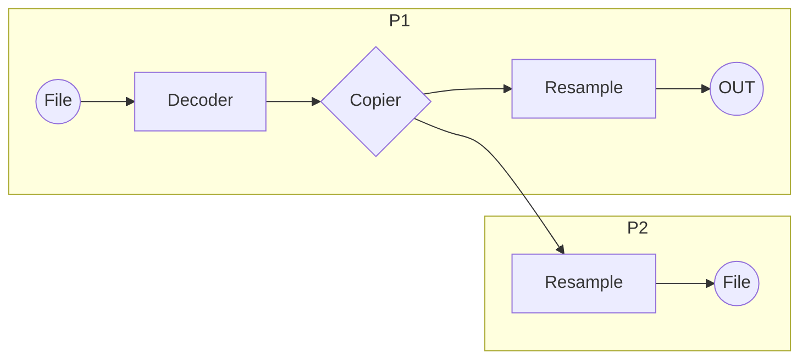
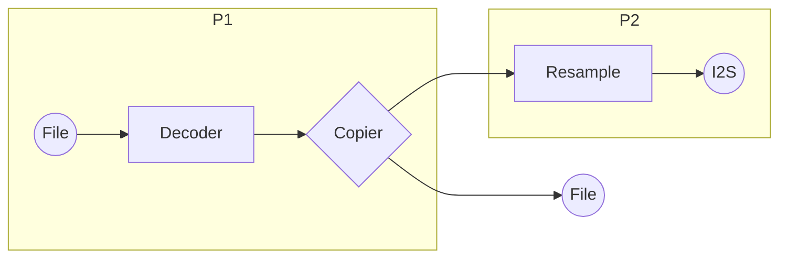
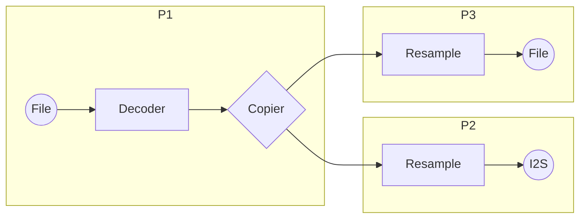

# GMF-Core 框架介绍
[English](./README.md)

下图展示了 GMF-Core 框架的类图关系。

GMF-Obj 是基础类，它为其他组件创建和销毁提供统一接口，便于对继承类对象进行管理操作：创建、复制、销毁。GMF-IO、GMF-Task 和 GMF-Element 都继承于它。

GMF-Core 主要由 GMF-Element、GMF-Pipeline、GMF-Task 组成，它的工作原理是以一个称为 Job 的工作片作为最小的处理单元，并实时加载这些工作片执行。
- GMF-Element 是工作片的提供者，为每个 element 提供三个基础的工作片，即 open，process 和 close。其中 open 一般是最先加载的工作片，process 会在 open 处理完后被加载，当所有 element 的工作片都处理完或者发生错误的时，close 工作片会被加载。
- GMF-Pipeline 负责管理和加载被连接的 element 的工作片，同时负责对 GMF-Task 的开始和停止进行控制。当 GMF-Pipeline 有 IN 和 OUT 的 IO 接口时，还负责对其进行打开和关闭操作。
- GMF-Task 处理工作片的流程参见下图。整个过程分为三个阶段，第一个阶段是 opening，把每个 element 的 open 和 process 工作片都调用一次，然后进入 running 阶段，这个过程是按 element 连接顺序循环执行每个 element 的 process 工作片，当工作片处理完或者出错则进入最后一个阶段 cleanup，它会调用每个 element 的 close 工作片来回收 element 资源。

## GMF-Pool
GMF-Pool 是 GMF-Element 和 GMF-IO 的管理单元。GMF-Pool 根据字符串列表创建 pipeline，先创建存储对象的复制品，然后连接成 pipeline。如果新 pipeline 需要调整 element 或 IO 初始配置参数，可以在 pipeline 创建成功后，通过 `esp_gmf_pipeline_get_el_by_name` 和 `OBJ_GET_CFG` 来修改。

## GMF-Element
GMF-Element 是一个基础类，用于实现具体功能的 element。它派生的类别有 audio element、picture element 等。

- audio element 实例化的类包含 encoder、decoder，以及 EQ、mixer、resample 等音频算法。
- picture element 实例化的类包含 JPEG encoder/decoder、PNG decoder 等。

GMF-Element 的输入输出端口是 GMF-Port，
它根据 element 的连接情况和请求的数据大小管理 payload 缓冲区，并让 payload 数据在 element 之间传递。GMF-Element 负责管理 GMF-Port 的连接能力和连接个数。

## GMF-DataBus
GMF-DataBus 是 GMF-Core 存取数据的模块，它使用 Acquire 再 Release 的方式访问数据。 GMF-DataBus 数据传输支持零拷贝和拷贝两种传输方式，也支持阻塞和非阻塞的访问方式。
目前 GMF-Core 支持了三种类型，分别是 Ringbuffer、PBuffer、FIFO 和 BlockBuffer，其中 PBuffer、FIFO 和 BlockBuffer 数据传输是零拷贝，Ringbuffer、FIFO 和 BlockBuffer 提供阻塞接口。

## GMF-Task
GMF-Task 是执行 job 的线程，它从工作列表中取出 job 顺序运行。当工作列表的 job 执行完即进入空闲状态，直到有新的 job 加入。job 是执行工作的最小单位，job 分为一次性和无限次的两种。

## GMF-Pipeline
GMF-Pipeline 由 element、task、IO 组成，一个 pipeline 必须有一个 task 来处理和调度任务。GMF-Pipeline 支持 pipeline 之间的顺序级联，即一个 pipeline 可以连接另外一个 pipeline，pipeline 的 event 也可以级联到后级的 pipeline 上。
Pipeline 还支持一些有事件依赖的 element 的顺序启动，比如一个 pipeline 由 decoder 和 resample 两个 element 组成，其中 resample 需要 decoder 解析出来的音乐信息才能开始工作，那么 GMF-Pipeline 会先只启动 decoder，直到解析到音乐信息后，pipeline 才启动 resample。这样的流程即简化了操作也不会带来噪音。

GMF-Pipeline 是 GMF 中可以独立运行的模块，为用户提供 pipeline 的控制接口，如 Pipeline 的 run\stop\pause\resume\reset 等。GMF-Pipeline 负责处理连接的 element 和 task 事件，还负责打开和关闭 IN 和 OUT port。在运行过程中 pipeline 还负责注册连接的 element job。GMF-Pipeline 一般由一个 GMF-Task、至少一个 element、最多一个 IN port 和最多一个 OUT port 组成。IN port 连接的是第一级 element 的输入，OUT port 连接的是最后一级 element 的输出。一个 pipeline 可以包含一个 element 或多个 element，支持的 element 数量没有上限，只受物理资源限制。

GMF-Pipeline 的灵活性很高，本文介绍 4 个基本的 pipeline 应用。

应用 1：一路 pipeline 从文件解码音频到 I2S 播放

应用 2：pipeline 输入输出不连接 port，而是使用回调函数，让用户去填充数据

应用 3：一路播放文件的 pipeline 拆成两个，通过 Ringbuffer 连接

应用 4：两个 pipeline 接入一个 mixer pipeline，应用于多路进一路出的混音场景

下面介绍的 pipeline 复杂度较高，应用在一些分流数据的复杂场景中，比如音乐播放的同时需要把音频数据给到 AEC 做参考。下图中都用了一个 copier 的 element，它具有一进多出的功能，输出可连接多路 pipeline 和一些其他输出形式。

应用 1：两路 pipeline 实现从单路输入多路输出的场景，解码的数据通过 copier 输出到另外一路 pipeline

应用 2：两路 pipeline 实现从单路输入多路输出的场景，一路通过 pipeline 连接输出，一路通过 port 输出

应用 3：三路 pipeline 实现从单路输入多路输出的场景，解码的数据可通过 ringbuffer 连接每路 pipeline

## 使用说明

GMF-Core API 的简单示例代码请参考 [test_apps](./test_apps/main/cases/gmf_pool_test.c)，更多实际应用示例请参考 GMF-Elements 的 examples。
