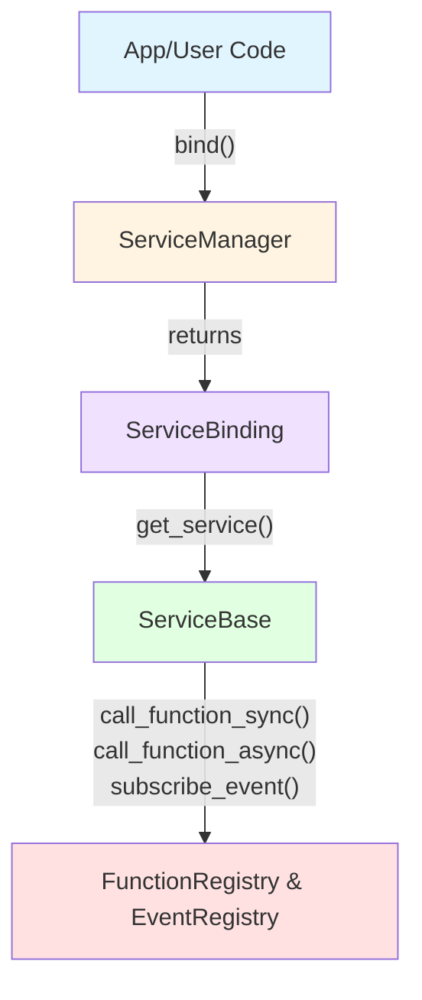
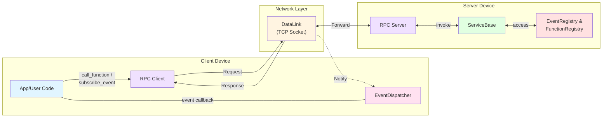

# ESP-Brookesia Service Manager

* [中文版本](./README_CN.md)

## Overview

`brookesia_service_manager` is a service management framework for the ESP-Brookesia ecosystem, providing:

- **Unified Service Lifecycle**: Centralized management of service initialization, startup, stop, and deinitialization through a plugin mechanism.
- **Dual Communication Modes**:
  - **Local Calls**: Direct function calls within the device through `ServiceBase`, featuring thread-safe, non-blocking, and high-performance characteristics.
  - **Remote RPC**: TCP-based client-server communication for cross-device or cross-language scenarios.
- **Event Publish/Subscribe**: Supports local and remote event subscription/notification mechanisms.
- **RAII-style Binding**: Automatic management of service running state (start/stop) on-demand through `ServiceBinding`.
- **Lightweight Dependencies**: Mainly depends on `esp-idf`, `brookesia_lib_utils`, and `esp-boost`.
- **Decoupling**:
  - Project code is completely decoupled from service implementations; to use a service, project code only needs to call the Service Manager API, while service implementations focus solely on business logic. The two are connected via a plugin mechanism.
  - To use a target service, the project only needs to add a dependency on the desired service component, without needing to modify its own code.

## Table of Contents

- [ESP-Brookesia Service Manager](#esp-brookesia-service-manager)
  - [Overview](#overview)
  - [Table of Contents](#table-of-contents)
  - [Communication Architecture](#communication-architecture)
    - [1. Local Mode](#1-local-mode)
    - [2. Remote RPC (Remote Procedure Call) Mode](#2-remote-rpc-remote-procedure-call-mode)
    - [Local Calls vs Remote RPC](#local-calls-vs-remote-rpc)
  - [How to Use](#how-to-use)
    - [Development Environment Requirements](#development-environment-requirements)
    - [Add to Project](#add-to-project)
  - [Usage Examples](#usage-examples)

## Communication Architecture

The `brookesia_service_manager` framework supports two communication modes:

### 1. Local Mode



**ASCII Diagram:**

```
[App/User Code]
       |
       | ServiceManager.bind()
       v
[ServiceBinding] ----> [ServiceBase]
                            |
                            |-- call_function_sync() / call_function_async()
                            |-- subscribe_event()
                            v
          [FunctionRegistry & EventRegistry]
```

### 2. Remote RPC (Remote Procedure Call) Mode



**ASCII Diagram:**

```
                                <--------- Response & Notify ----------
[App/User Code] <-> RPC Client |<--- DataLink (TCP Socket + JSON) ---->| RPC Server <-> [ServiceBase]
       ^                |       --------------- Request -------------->                       |
       |                |                                                                     |
       |                v                                                                     v
       +-------- EventDispatcher                                                EventRegistry & FunctionRegistry
```

### Local Calls vs Remote RPC

| Comparison Item | Local Calls (ServiceBase) | Remote RPC (rpc::Client) |
| --------------- | ------------------------- | ------------------------- |
| **Deployment**  | ✅ Same device            | ✅ Cross-device communication |
| **Communication** | Direct function calls | TCP Socket + JSON |
| **Latency**     | ⚡ Millisecond level (very low) | ⚠️ Millisecond to second level (depends on network) |
| **Performance**  | ✅ High performance, minimal serialization overhead | ⚠️ Requires extensive serialization/deserialization |
| **Frequency**    | ✅ High-frequency calls   | ⚠️ Medium to low-frequency calls |
| **Thread Safety** | ✅ Built-in async scheduling, thread-safe protection | ✅ Network isolation |
| **Language Support** | C++ only | ✅ Language-independent (Socket + JSON protocol) |
| **Network Dependency** | ❌ No network required | ✅ Same local area network |
| **Typical Scenarios** | In-device service collaboration | Cross-device or cross-language service calls |

## How to Use

### Development Environment Requirements

Before using this library, ensure you have installed the following SDK development environment:

- [ESP-IDF](https://github.com/espressif/esp-idf): `>=5.5,<6`

> [!NOTE]
> For SDK installation instructions, please refer to [ESP-IDF Programming Guide - Installation](https://docs.espressif.com/projects/esp-idf/en/latest/esp32/get-started/index.html#get-started-how-to-get-esp-idf)

### Add to Project

`brookesia_service_manager` has been uploaded to the [Espressif Component Registry](https://components.espressif.com/). You can add it to your project in the following ways:

1. **Using Command Line**

   Run the following command in your project directory:

   ```bash
   idf.py add-dependency "espressif/brookesia_service_manager"
   ```

2. **Modify Configuration File**

   Create or modify the *idf_component.yml* file in your project directory:

   ```yaml
   dependencies:
     espressif/brookesia_service_manager: "*"
   ```

For detailed instructions, please refer to [Espressif Documentation - IDF Component Manager](https://docs.espressif.com/projects/esp-idf/en/latest/esp32/api-guides/tools/idf-component-manager.html).

## Usage Examples

Please refer to [Usage Examples](./Usage.md) for detailed usage examples.
