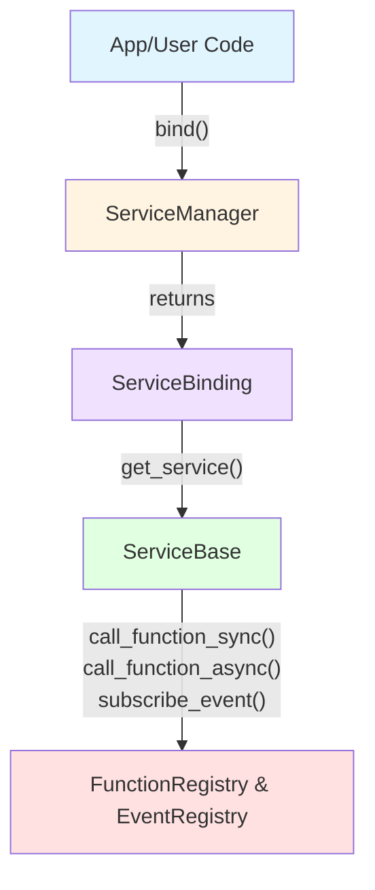
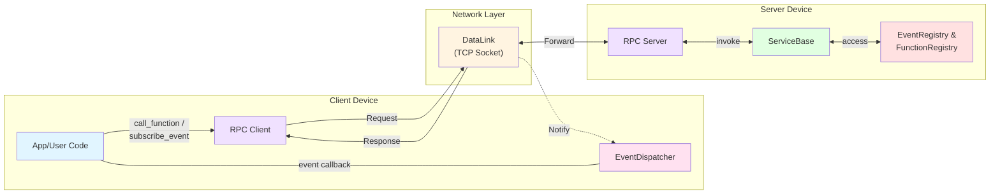

# ESP-Brookesia Service Manager

## Overview

`brookesia_service_manager` is a service management framework for the ESP-Brookesia ecosystem, providing:

- **Unified Service Lifecycle**: Centralized management of service initialization, startup, stop, and deinitialization through a plugin mechanism.
- **Dual Communication Modes**:
  - **Local Calls**: Direct function calls within the device through `ServiceBase`, featuring thread-safe, non-blocking, and high-performance characteristics.
  - **Remote RPC**: TCP-based client-server communication for cross-device or cross-language scenarios.
- **Event Publish/Subscribe**: Supports local and remote event subscription/notification mechanisms.
- **RAII-style Binding**: Automatic management of service running state (start/stop) on-demand through `ServiceBinding`.
- **Lightweight Dependencies**: Mainly depends on `esp-idf`, `brookesia_lib_utils`, and `esp-boost`.
- **Decoupling**:
  - Project code is completely decoupled from service implementations; to use a service, project code only needs to call the Service Manager API, while service implementations focus solely on business logic. The two are connected via a plugin mechanism.
  - To use a target service, the project only needs to add a dependency on the desired service component, without needing to modify its own code.

## Communication Architecture

The `brookesia_service_manager` framework supports two communication modes:

### 1. Local Mode



**ASCII Diagram:**

```
[App/User Code]
       |
       | ServiceManager.bind()
       v
[ServiceBinding] ----> [ServiceBase]
                            |
                            |-- call_function_sync() / call_function_async()
                            |-- subscribe_event()
                            v
          [FunctionRegistry & EventRegistry]
```

### 2. Remote RPC (Remote Procedure Call) Mode



**ASCII Diagram:**

```
                                <--------- Response & Notify ----------
[App/User Code] <-> RPC Client |<--- DataLink (TCP Socket + JSON) ---->| RPC Server <-> [ServiceBase]
       ^                |       --------------- Request -------------->                       |
       |                |                                                                     |
       |                v                                                                     v
       +-------- EventDispatcher                                                EventRegistry & FunctionRegistry
```

### Local Calls vs Remote RPC

| Comparison Item | Local Calls (ServiceBase) | Remote RPC (rpc::Client) |
| --------------- | ------------------------- | ------------------------- |
| **Deployment**  | ✅ Same device            | ✅ Cross-device communication |
| **Communication** | Direct function calls | TCP Socket + JSON |
| **Latency**     | ⚡ Millisecond level (very low) | ⚠️ Millisecond to second level (depends on network) |
| **Performance**  | ✅ High performance, minimal serialization overhead | ⚠️ Requires extensive serialization/deserialization |
| **Frequency**    | ✅ High-frequency calls   | ⚠️ Medium to low-frequency calls |
| **Thread Safety** | ✅ Built-in async scheduling, thread-safe protection | ✅ Network isolation |
| **Language Support** | C++ only | ✅ Language-independent (Socket + JSON protocol) |
| **Network Dependency** | ❌ No network required | ✅ Same local area network |
| **Typical Scenarios** | In-device service collaboration | Cross-device or cross-language service calls |

## How to Use

### Development Environment Requirements

Before using this library, ensure you have installed the following SDK development environment:

- [ESP-IDF](https://github.com/espressif/esp-idf): `>=5.5,<6`

> [!NOTE]
> For SDK installation instructions, please refer to [ESP-IDF Programming Guide - Installation](https://docs.espressif.com/projects/esp-idf/en/latest/esp32/get-started/index.html#get-started-how-to-get-esp-idf)

`brookesia_service_manager` has the following dependency components:

| **Dependency Component** | **Version Requirement** |
| ------------------------ | ----------------------- |
| [cmake_utilities](https://components.espressif.com/components/espressif/cmake_utilities) | 0.* |
| [brookesia_lib_utils](https://components.espressif.com/components/espressif/brookesia_lib_utils) | 0.7.* |

### Add to Project

`brookesia_service_manager` has been uploaded to the [Espressif Component Registry](https://components.espressif.com/). You can add it to your project in the following ways:

1. **Using Command Line**

   Run the following command in your project directory:

   ```bash
   idf.py add-dependency "espressif/brookesia_service_manager"
   ```

2. **Modify Configuration File**

   Create or modify the *idf_component.yml* file in your project directory:

   ```yaml
   dependencies:
     espressif/brookesia_service_manager: "*"
   ```

For detailed instructions, please refer to [Espressif Documentation - IDF Component Manager](https://docs.espressif.com/projects/esp-idf/en/latest/esp32/api-guides/tools/idf-component-manager.html).

## Usage Examples

### Local Services

#### Basic Usage

```cpp
#include "brookesia/lib_utils.hpp"
#include "brookesia/service_manager.hpp"

using namespace esp_brookesia::service;

void app_main()
{
    auto &service_manager = ServiceManager::get_instance();

    // 1. Initialize and start the service manager
    if (!service_manager.start()) {
        BROOKESIA_LOGE("Failed to start service manager");
        return;
    }

    // 2. Bind service (automatically starts target service on first bind, multiple bindings share the same service instance)
    const std::string service_name = "test_service";
    auto binding = service_manager.bind(service_name);
    if (!binding.is_valid()) {
        BROOKESIA_LOGE("Failed to bind service");
        return;
    }

    auto service = binding.get_service();

    // ... Use service ...

    // 3. Unbind
    // binding automatically unbinds when it goes out of scope
    // or use release() to manually unbind
    binding.release();

    // 4. Stop the service manager
    service_manager.stop();
}
```

#### Synchronous Function Calls

```cpp
// Get service through binding
auto binding = service_manager.bind("test_service");
auto service = binding.get_service();

// Call function with timeout (blocking)
FunctionParameterMap args;
args["a"] = FunctionValue(10.0);
args["b"] = FunctionValue(20.0);

auto result = service->call_function_sync("add", std::move(args), 100);  // 100ms timeout
if (result.success) {
    double value = std::get<double>(*result.data);
    BROOKESIA_LOGI("Result: %1%", value);
} else {
    BROOKESIA_LOGE("Error: %1%", result.error_message.c_str());
}
```

#### Asynchronous Function Calls

```cpp
// Get service through binding
auto binding = service_manager.bind("test_service");
auto service = binding.get_service();

// Start async call (returns immediately)
FunctionParameterMap args;
args["a"] = FunctionValue(10.0);
args["b"] = FunctionValue(20.0);

auto future = service->call_function_async("add", std::move(args));

// Do other work while function executes...
do_other_work();

// Wait for result when needed
auto result = future.get();  // Blocks until result is ready
if (result.success) {
    double value = std::get<double>(*result.data);
    BROOKESIA_LOGI("Result: %1%", value);
}
```

#### Concurrent Function Calls

```cpp
// Get service through binding
auto binding = service_manager.bind("test_service");
auto service = binding.get_service();

// Start multiple async calls concurrently
std::vector<std::future<FunctionResult>> futures;

for (int i = 0; i < 5; i++) {
    FunctionParameterMap args;
    args["a"] = FunctionValue(static_cast<double>(i));
    args["b"] = FunctionValue(1.0);
    futures.push_back(service->call_function_async("add", std::move(args)));
}

// Collect results (executed in parallel, not sequentially)
for (auto &future : futures) {
    auto result = future.get();
    if (result.success) {
        double value = std::get<double>(*result.data);
        BROOKESIA_LOGI("Result: %1%", value);
    }
}
```

#### Multiple Parameter Formats

```cpp
// Get service through binding
auto binding = service_manager.bind("test_service");
auto service = binding.get_service();

// 1. Using std::vector
std::vector<FunctionValue> args_vector;
args_vector.push_back(FunctionValue(15.0));  // First parameter
args_vector.push_back(FunctionValue(25.0));  // Second parameter
auto result = service->call_function_sync("add", std::move(args_vector), 100);

// 2. Using JSON object
boost::json::object args_json;
args_json["a"] = 15.0;
args_json["b"] = 25.0;
auto result = service->call_function_sync("add", std::move(args_json), 100);

// Async calls also support the same formats
auto future = service->call_function_async("add", std::move(args_json));
```

#### Event Publish/Subscribe

* Publish Service Events

```cpp
// publish_event is a protected member function of ServiceBase, so it needs to be called in subclass member functions
{
    // Send event: key-value format
    publish_event("value_changed", {{"value", 100.0}});

    // Send event: ordered array format
    publish_event("value_changed", {100.0});

    // Send event: JSON object format
    publish_event("value_changed", boost::json::object{{"value", 100.0}});
}
```

* Subscribe to Service Events

```cpp
// Get service through binding
auto binding = service_manager.bind("test_service");
auto service = binding.get_service();

// Subscribe to service events
auto connection = service->subscribe_event(
    "value_changed",
    [](const std::string &event_name, const EventItemMap &data) {
        if (data.find("value") != data.end()) {
            double value = std::get<double>(data.at("value"));
            BROOKESIA_LOGI("Event received: %1%, value = %2%", event_name.c_str(), value);
        }
    }
);

// Check if subscription was successful
if (connection.connected()) {
    BROOKESIA_LOGI("Successfully subscribed to event");
}

// ... Application logic ...

// Connection automatically disconnects when it goes out of scope
// Or use std::move to transfer ownership to extend lifetime
auto new_connection = std::move(connection);
```

### Remote Services

Remote services enable cross-device or cross-language service calls through RPC mechanism, using TCP Socket and JSON protocol for communication. Ensure that the server and client are on the same local area network.

#### RPC Server

```cpp
auto &service_manager = ServiceManager::get_instance();

// 1. Initialize and start the service manager
if (!service_manager.start()) {
    BROOKESIA_LOGE("Failed to start service manager");
    return;
}

// 2. Start RPC server (using default config: port 65500, max connections 2)
if (!service_manager.start_rpc_server()) {
    BROOKESIA_LOGE("Failed to start RPC server");
    return;
}

// 3. Connect RPC server to services (empty list means connect all services)
if (!service_manager.connect_rpc_server_to_services({"test_service"})) {
    BROOKESIA_LOGE("Failed to connect RPC server to services");
    return;
}

// ... Use RPC server ...

// 4. Cleanup
service_manager.disconnect_rpc_server_from_services();
service_manager.stop_rpc_server();
```

#### RPC Client

* Single Call (No Need to Create Client)

```cpp
auto &service_manager = ServiceManager::get_instance();

// Directly call remote function (client is automatically created and destroyed internally)
boost::json::object params;
params["a"] = 10.0;
params["b"] = 20.0;

auto result = service_manager.call_rpc_function_sync(
    "192.168.1.100",      // host
    "test_service",        // service_name
    "add",                 // function_name
    std::move(params),     // params
    2000,                  // timeout_ms (optional, defaults to configured value)
    65500                  // port (optional, defaults to configured value)
);

if (result.success) {
    double value = std::get<double>(*result.data);
    BROOKESIA_LOGI("Remote call result: %1%", value);
} else {
    BROOKESIA_LOGE("Remote call failed: %1%", result.error_message.c_str());
}
```

* Create and Manage RPC Client

```cpp
auto &service_manager = ServiceManager::get_instance();

// 1. Create RPC client (using default config)
auto client = service_manager.new_rpc_client();
if (!client) {
    BROOKESIA_LOGE("Failed to create RPC client");
    return;
}

// 2. Connect to RPC server (assuming RPC server address is 192.168.1.100, port 65500)
if (!client->connect("192.168.1.100", 65500, 2000)) {  // host, port, timeout_ms
    BROOKESIA_LOGE("Failed to connect to RPC server");
    return;
}

// 3. Check connection status
if (client->is_connected()) {
    BROOKESIA_LOGI("RPC client connected successfully");
}

// ... Use client to call remote functions or subscribe to events ...

// 4. Disconnect
client->disconnect();
```

* Synchronous Remote Function Calls

```cpp
// Call remote function through RPC client
boost::json::object params;
params["a"] = 10.0;
params["b"] = 20.0;

auto result = client->call_function_sync("test_service", "add", std::move(params), 2000);
// Parameters: service_name, function_name, params, timeout_ms

if (result.success) {
    double value = std::get<double>(*result.data);
    BROOKESIA_LOGI("Remote call result: %1%", value);
} else {
    BROOKESIA_LOGE("Remote call failed: %1%", result.error_message.c_str());
}
```

* Asynchronous Remote Function Calls

```cpp
// Start async call (returns immediately)
boost::json::object params;
params["a"] = 15.0;
params["b"] = 25.0;

auto future = client->call_function_async("test_service", "add", std::move(params));
// Parameters: service_name, function_name, params

// Do other work while function executes...
do_other_work();

// Wait for result when needed
auto result = future.get();  // Blocks until result is ready
if (result.success) {
    double value = std::get<double>(*result.data);
    BROOKESIA_LOGI("Remote call result: %1%", value);
}
```

* Concurrent Remote Function Calls

```cpp
// Start multiple async calls concurrently
std::vector<std::future<FunctionResult>> futures;

for (int i = 0; i < 5; i++) {
    boost::json::object params;
    params["a"] = static_cast<double>(i);
    params["b"] = 1.0;
    futures.push_back(client->call_function_async("test_service", "add", std::move(params)));
}

// Collect results (executed in parallel, not sequentially)
for (auto &future : futures) {
    auto result = future.get();
    if (result.success) {
        double value = std::get<double>(*result.data);
        BROOKESIA_LOGI("Remote call result: %1%", value);
    }
}
```

* Remote Event Subscription

```cpp
// Subscribe to remote service events
std::string subscription_id = client->subscribe_event(
    "test_service",  // service_name
    "value_changed", // event_name
    [](const EventDispatcher::EventItemMap &data) {
        if (data.find("value") != data.end()) {
            double value = std::get<double>(data.at("value"));
            BROOKESIA_LOGI("Remote event received: value = %1%", value);
        }
    },
    2000  // timeout_ms
);

if (subscription_id.empty()) {
    BROOKESIA_LOGE("Failed to subscribe to remote event");
} else {
    BROOKESIA_LOGI("Successfully subscribed to remote event, subscription_id: %1%", subscription_id.c_str());
}

// ... Application logic ...

// Unsubscribe
if (!subscription_id.empty()) {
    if (client->unsubscribe_events("test_service", {subscription_id}, 2000)) {
        BROOKESIA_LOGI("Successfully unsubscribed from remote event");
    }
}
```

## Creating Custom Services

To create a custom service, inherit from `ServiceBase` and implement the required virtual functions. Add the `WHOLE_ARCHIVE` option in `CMakeLists.txt`'s `idf_component_register()` to ensure the service is properly linked:

* **service_test.hpp**

```cpp
#include "brookesia/service_manager/service/base.hpp"

namespace esp_brookesia::service {

class ServiceTest : public ServiceBase {
public:
    enum FunctionIndex {
        FunctionIndexAdd,
        FunctionIndexDivide,
        FunctionIndexMax,
    };

    enum EventIndex {
        EventIndexValueChange,
        EventIndexMax,
    };

    static constexpr const char *SERVICE_NAME = "service_test";
    inline static const FunctionSchema FUNCTION_DEFINITIONS[FunctionIndexMax] = {
        [FunctionIndexAdd] = {
            "add",
            "Add two numbers together",
            {
                {"a", "First number", FunctionValueType::Number},
                {"b", "Second number", FunctionValueType::Number}
            }
        },
        [FunctionIndexDivide] = {
            "divide",
            "Divide two numbers",
            {
                {"a", "First number", FunctionValueType::Number},
                {"b", "Second number", FunctionValueType::Number}
            }
        },
    };
    inline static const EventSchema EVENT_DEFINITIONS[EventIndexMax] = {
        [EventIndexValueChange] = {
            "value_change",
            "Value change event",
            {
                {"value", "", EventItemType::Number}
            }
        },
    };

    ServiceTest()
        : ServiceBase({
        .name = SERVICE_NAME,
        // .dependencies = {}, // Optional: List of dependent service names, will be started in order
        // .task_scheduler_config = {} // Optional: Task scheduler configuration.
                                       // If configured, service request tasks will be scheduled to this scheduler;
                                       // otherwise, ServiceManager's scheduler will be used
    })
    {}
    ~ServiceTest() = default;

private:
    bool on_init() override;
    void on_deinit() override;
    bool on_start() override;
    void on_stop() override;

    // Function implementations
    std::expected<double, std::string> function_add(double a, double b);
    std::expected<double, std::string> function_divide(double a, double b);

    // Provide function definitions
    std::vector<FunctionSchema> get_function_definitions() override
    {
        return std::vector<FunctionSchema>(FUNCTION_DEFINITIONS, FUNCTION_DEFINITIONS + FunctionIndexMax);
    }
    // Provide event definitions
    std::vector<EventSchema> get_event_definitions() override
    {
        return std::vector<EventSchema>(EVENT_DEFINITIONS, EVENT_DEFINITIONS + EventIndexMax);
    }
    // Provide function handlers
    ServiceBase::FunctionHandlerMap get_function_handlers() override
    {
        return {
            BROOKESIA_SERVICE_FUNC_HANDLER_2(
                FUNCTION_DEFINITIONS[FunctionIndexAdd].name,
                FUNCTION_DEFINITIONS[FunctionIndexAdd].parameters[0].name, double,
                FUNCTION_DEFINITIONS[FunctionIndexAdd].parameters[1].name, double,
                function_add(PARAM1, PARAM2)
            ),
            BROOKESIA_SERVICE_FUNC_HANDLER_2(
                FUNCTION_DEFINITIONS[FunctionIndexDivide].name,
                FUNCTION_DEFINITIONS[FunctionIndexDivide].parameters[0].name, double,
                FUNCTION_DEFINITIONS[FunctionIndexDivide].parameters[1].name, double,
                function_divide(PARAM1, PARAM2)
            ),
        };
    }
};

} // namespace esp_brookesia::service
```

* **service_test.cpp**

```cpp
#include "service_test.hpp"

namespace esp_brookesia::service {

bool ServiceTest::on_init()
{
    // ...
    return true;
}

void ServiceTest::on_deinit()
{
    // ...
}

bool ServiceTest::on_start()
{
    // ...
    return true;
}

void ServiceTest::on_stop()
{
    // ...
}

std::expected<double, std::string> ServiceTest::function_add(double a, double b)
{
    return a + b;
}

std::expected<double, std::string> ServiceTest::function_divide(double a, double b)
{
    if (b == 0) {
        return std::unexpected("Division by zero");
    }
    return a / b;
}

// Register service using plugin mechanism
BROOKESIA_PLUGIN_REGISTER(ServiceBase, MyService, "my_service");

// If the service subclass uses singleton pattern, you can use `BROOKESIA_PLUGIN_REGISTER_SINGLETON` macro to register the service
// BROOKESIA_PLUGIN_REGISTER_SINGLETON(ServiceBase, MyService, "my_service", MyService::get_instance());

} // namespace esp_brookesia::service

```

* **CMakeLists.txt**
```cmake
idf_component_register(
    SRCS "service_test.cpp"
    INCLUDE_DIRS "."
    WHOLE_ARCHIVE
)
```

>[!NOTE]
> * For custom service examples, please refer to [service_test.hpp](test_apps/main/service_test.hpp), [service_test.cpp](test_apps/main/service_test.cpp), or other service components.
> * The `WHOLE_ARCHIVE` option must be added to the service component's *CMakeLists.txt* `idf_component_register` to ensure the service is properly linked, otherwise the service will not be properly linked.
