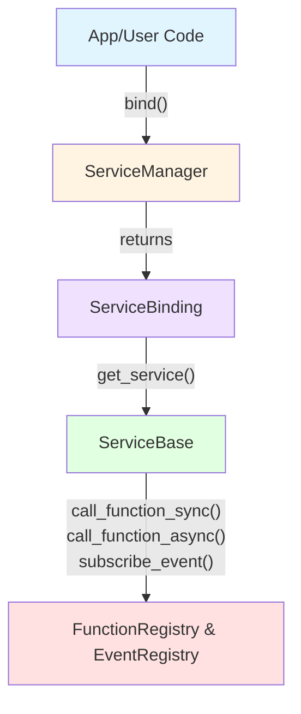
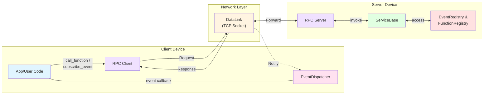

# ESP-Brookesia Service Manager

* [English Version](./README.md)

## 概述

`brookesia_service_manager` 是为 ESP-Brookesia 生态系统提供的服务管理框架，提供：

- **统一的服务生命周期**：通过插件机制，集中式管理服务初始化、启动、停止和反初始化。
- **双重通信模式**：
  - **本地调用**：通过 `ServiceBase` 进行设备内直接函数调用，具有线程安全、非阻塞、性能高效的特点。
  - **远程 RPC**：基于 TCP 的客户端-服务器通信，用于跨设备或跨语言场景。
- **事件发布/订阅**：支持本地和远程事件订阅/通知机制。
- **RAII 风格绑定**：通过 `ServiceBinding` 按需自动管理服务运行状态（启动/停止）。
- **轻量级依赖**：主要依赖 `esp-idf`、`brookesia_lib_utils`、`esp-boost`。
- **解耦合**：
  - 工程代码与服务实现完全解耦，工程代码只需调用服务管理器的 API 即可使用服务，服务实现只负责实现业务逻辑，两者通过插件机制进行耦合。
  - 工程仅需添加目标服务组件的依赖即可使用该服务，无需修改工程代码。

## 目录

- [ESP-Brookesia Service Manager](#esp-brookesia-service-manager)
  - [概述](#概述)
  - [目录](#目录)
  - [通信架构](#通信架构)
    - [1. 本地模式](#1-本地模式)
    - [2. 远程 RPC（Remote Procedure Call） 模式](#2-远程-rpcremote-procedure-call-模式)
    - [本地调用 vs 远程 RPC](#本地调用-vs-远程-rpc)
  - [如何使用](#如何使用)
    - [开发环境要求](#开发环境要求)
    - [添加到工程](#添加到工程)
  - [使用示例](#使用示例)

## 通信架构

`brookesia_service_manager` 框架支持两种通信模式：

### 1. 本地模式



**ASCII 图：**

```
[App/User Code]
       |
       | ServiceManager.bind()
       v
[ServiceBinding] ----> [ServiceBase]
                            |
                            |-- call_function_sync() / call_function_async()
                            |-- subscribe_event()
                            v
          [FunctionRegistry & EventRegistry]
```

### 2. 远程 RPC（Remote Procedure Call） 模式



**ASCII 图：**

```
                                <--------- Response & Notify ----------
[App/User Code] <-> RPC Client |<--- DataLink (TCP Socket + JSON) ---->| RPC Server <-> [ServiceBase]
       ^                |       --------------- Request -------------->                       |
       |                |                                                                     |
       |                v                                                                     v
       +-------- EventDispatcher                                                EventRegistry & FunctionRegistry
```

### 本地调用 vs 远程 RPC

|    对比项    |   本地调用（ServiceBase）    |     远程 RPC（rpc::Client）      |
| ------------ | ---------------------------- | -------------------------------- |
| **部署位置** | ✅ 同一设备内                 | ✅ 跨设备通信                     |
| **通信方式** | 直接函数调用                 | TCP Socket + JSON                |
| **延迟**     | ⚡ 毫秒级（很低）             | ⚠️ 毫秒~秒级（取决于网络）       |
| **性能**     | ✅ 高性能，无序列化开销       | ⚠️ 需要序列化/反序列化开销       |
| **适用频率** | ✅ 高频调用                   | ⚠️ 中低频调用                    |
| **线程安全** | ✅ 内置异步调度，线程安全保护 | ✅ 网络隔离                       |
| **语言支持** | C++ only                     | ✅ 语言无关（Socket + JSON 协议） |
| **网络依赖** | ❌ 无需网络                   | ✅ 同一局域网内                   |
| **典型场景** | 设备内服务协作               | 跨设备或跨语言服务调用           |

## 如何使用

### 开发环境要求

使用本库前，请确保已安装以下 SDK 开发环境：

- [ESP-IDF](https://github.com/espressif/esp-idf): `>=5.5,<6`

> [!NOTE]
> SDK 的安装方法请参阅 [ESP-IDF 编程指南 - 安装](https://docs.espressif.com/projects/esp-idf/zh_CN/latest/esp32/get-started/index.html#get-started-how-to-get-esp-idf)

### 添加到工程

`brookesia_service_manager` 已上传到 [Espressif 组件库](https://components.espressif.com/)，您可以通过以下方式将其添加到工程中：

1. **使用命令行**

    在工程目录下运行以下命令：

   ```bash
   idf.py add-dependency "espressif/brookesia_service_manager"
   ```

2. **修改配置文件**

   在工程目录下创建或修改 *idf_component.yml* 文件：

   ```yaml
   dependencies:
     espressif/brookesia_service_manager: "*"
   ```

详细说明请参阅 [Espressif 文档 - IDF 组件管理器](https://docs.espressif.com/projects/esp-idf/zh_CN/latest/esp32/api-guides/tools/idf-component-manager.html)。

## 使用示例

请参阅 [使用示例](./Usage_CN.md) 获取详细的使用示例。
