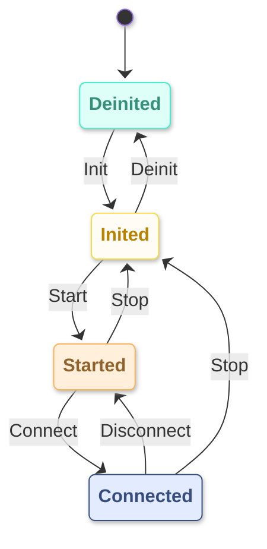

# ESP-Brookesia WiFi Service

* [中文版本](./README_CN.md)

## Overview

`brookesia_service_wifi` is a WiFi connection management service for the ESP-Brookesia ecosystem, providing:

- **State Machine Management**: Unified management of WiFi lifecycle states including initialization, startup, and connection through a state machine
- **Auto Reconnection**: Supports automatic connection to historical APs and automatic reconnection attempts after disconnection
- **WiFi Scanning**: Supports periodic scanning of surrounding APs and automatic discovery of connectable APs
- **Connection Management**: Manages target AP and connected AP lists, supporting multiple AP history records
- **Event Notifications**: Provides rich event notification mechanisms for real-time feedback on WiFi state changes
- **Persistent Storage**: Optionally works with `brookesia_service_nvs` service to persistently save connection configurations and other parameters

## Table of Contents

- [ESP-Brookesia WiFi Service](#esp-brookesia-wifi-service)
  - [Overview](#overview)
  - [Table of Contents](#table-of-contents)
  - [Features](#features)
    - [State Machine Management](#state-machine-management)
      - [State Transitions](#state-transitions)
    - [Auto Reconnection Mechanism](#auto-reconnection-mechanism)
    - [WiFi Scanning](#wifi-scanning)
  - [Development Environment Requirements](#development-environment-requirements)
  - [Adding to Project](#adding-to-project)

## Features

### State Machine Management

The WiFi service uses a state machine to uniformly manage WiFi lifecycle states, ensuring safety and consistency of state transitions. The state machine contains 4 core states:

| State | Description |
|-------|-------------|
| `Deinited` | WiFi not initialized, initial system state |
| `Inited` | WiFi initialized but not started, parameters can be configured |
| `Started` | WiFi started, scanning or waiting for connection |
| `Connected` | WiFi successfully connected to AP, normal communication available |

#### State Transitions

State transitions are achieved by triggering corresponding actions:

- **Forward Flow**: `Deinited` → `Inited` (Init) → `Started` (Start) → `Connected` (Connect)
- **Disconnect**: `Connected` → `Started` (Disconnect)
- **Stop Process**: `Started` / `Connected` → `Inited` (Stop)
- **Deinitialize**: `Inited` → `Deinited` (Deinit)

The state transition diagram is as follows:



### Auto Reconnection Mechanism

- **Auto Connect on Startup**: Automatically attempts to connect to historical connectable APs after WiFi starts
- **Auto Reconnect after Disconnection**: Automatically attempts to connect to historical connectable APs after detecting unexpected disconnection
- **Auto Connect on Scan Discovery**: Automatically triggers connection when target AP or historical connectable AP is discovered during scanning

### WiFi Scanning

- **Periodic Scanning**: Supports configuring scan interval and timeout
- **Scan Result Notifications**: Real-time notification of scanned AP information through events
- **AP Information**: Includes SSID, signal strength level, encryption status, and other information

## Development Environment Requirements

Before using this library, please ensure the following SDK development environment is installed:

- [ESP-IDF](https://github.com/espressif/esp-idf): `>=5.5,<6`

> [!NOTE]
> For SDK installation instructions, please refer to [ESP-IDF Programming Guide - Installation](https://docs.espressif.com/projects/esp-idf/en/latest/esp32/get-started/index.html#get-started-how-to-get-esp-idf)

## Adding to Project

`brookesia_service_wifi` has been uploaded to the [Espressif Component Registry](https://components.espressif.com/). You can add it to your project in the following ways:

1. **Using Command Line**

   Run the following command in your project directory:

   ```bash
   idf.py add-dependency "espressif/brookesia_service_wifi"
   ```

2. **Modify Configuration File**

   Create or modify the *idf_component.yml* file in your project directory:

   ```yaml
   dependencies:
     espressif/brookesia_service_wifi: "*"
   ```

For detailed instructions, please refer to [Espressif Documentation - IDF Component Manager](https://docs.espressif.com/projects/esp-idf/en/latest/esp32/api-guides/tools/idf-component-manager.html).
