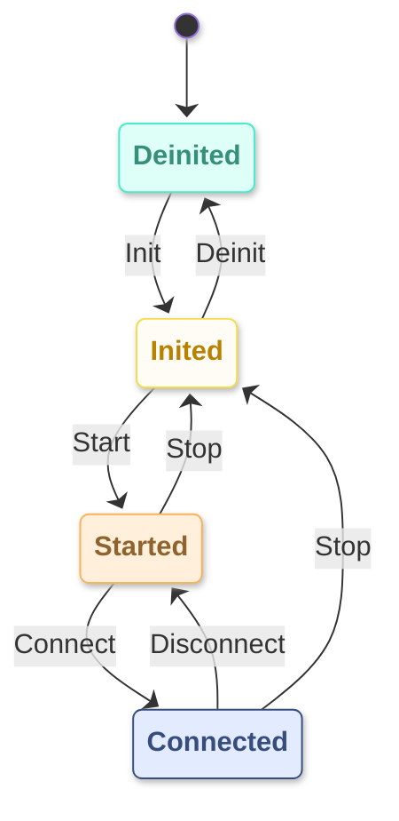

# ESP-Brookesia WiFi Service

* [English Version](./README.md)

## 概述

`brookesia_service_wifi` 是为 ESP-Brookesia 生态系统提供的 WiFi 连接管理服务，提供：

- **状态机管理**：通过状态机统一管理 WiFi 的初始化、启动、连接等生命周期状态
- **自动重连**：支持自动连接历史 AP，并在断开后自动尝试重连
- **WiFi 扫描**：支持周期性扫描周围 AP，并自动发现可连接的 AP
- **连接管理**：管理目标 AP 和已连接 AP 列表，支持多 AP 历史记录
- **事件通知**：提供丰富的事件通知机制，实时反馈 WiFi 状态变化
- **持久化存储**：可选搭配 `brookesia_service_nvs` 服务持久化保存连接配置和其他参数

## 目录

- [ESP-Brookesia WiFi Service](#esp-brookesia-wifi-service)
  - [概述](#概述)
  - [目录](#目录)
  - [功能特性](#功能特性)
    - [状态机管理](#状态机管理)
      - [状态转换](#状态转换)
    - [自动重连机制](#自动重连机制)
    - [WiFi 扫描](#wifi-扫描)
  - [开发环境要求](#开发环境要求)
  - [添加到工程](#添加到工程)

## 功能特性

### 状态机管理

WiFi 服务通过状态机统一管理 WiFi 的生命周期状态，确保状态转换的安全性和一致性。状态机包含 4 个核心状态：

| 状态 | 说明 |
|------|------|
| `Deinited` | WiFi 未初始化，系统初始状态 |
| `Inited` | WiFi 已初始化，但未启动，可以配置参数 |
| `Started` | WiFi 已启动，正在扫描或等待连接 |
| `Connected` | WiFi 已成功连接到 AP，可以正常通信 |

#### 状态转换

状态转换通过触发相应的动作（Action）来实现：

- **正向流程**：`Deinited` → `Inited`（Init）→ `Started`（Start）→ `Connected`（Connect）
- **断开连接**：`Connected` → `Started`（Disconnect）
- **停止流程**：`Started` / `Connected` → `Inited`（Stop）
- **反初始化**：`Inited` → `Deinited`（Deinit）

状态转换图如下：



### 自动重连机制

- **启动时自动连接**：WiFi 启动后自动尝试连接历史可连接的 AP
- **断开后自动重连**：检测到意外断开后，自动尝试连接历史可连接的 AP
- **扫描发现自动连接**：扫描过程中发现目标 AP 或历史可连接 AP 时，自动触发连接

### WiFi 扫描

- **周期性扫描**：支持配置扫描间隔和超时时间
- **扫描结果通知**：通过事件实时通知扫描到的 AP 信息
- **AP 信息**：包含 SSID、信号强度等级、是否加密等信息

## 开发环境要求

使用本库前，请确保已安装以下 SDK 开发环境：

- [ESP-IDF](https://github.com/espressif/esp-idf): `>=5.5,<6`

> [!NOTE]
> SDK 的安装方法请参阅 [ESP-IDF 编程指南 - 安装](https://docs.espressif.com/projects/esp-idf/zh_CN/latest/esp32/get-started/index.html#get-started-how-to-get-esp-idf)

## 添加到工程

`brookesia_service_wifi` 已上传到 [Espressif 组件库](https://components.espressif.com/)，您可以通过以下方式将其添加到工程中：

1. **使用命令行**

   在工程目录下运行以下命令：

   ```bash
   idf.py add-dependency "espressif/brookesia_service_wifi"
   ```

2. **修改配置文件**

   在工程目录下创建或修改 *idf_component.yml* 文件：

   ```yaml
   dependencies:
     espressif/brookesia_service_wifi: "*"
   ```

详细说明请参阅 [Espressif 文档 - IDF 组件管理器](https://docs.espressif.com/projects/esp-idf/zh_CN/latest/esp32/api-guides/tools/idf-component-manager.html)。
